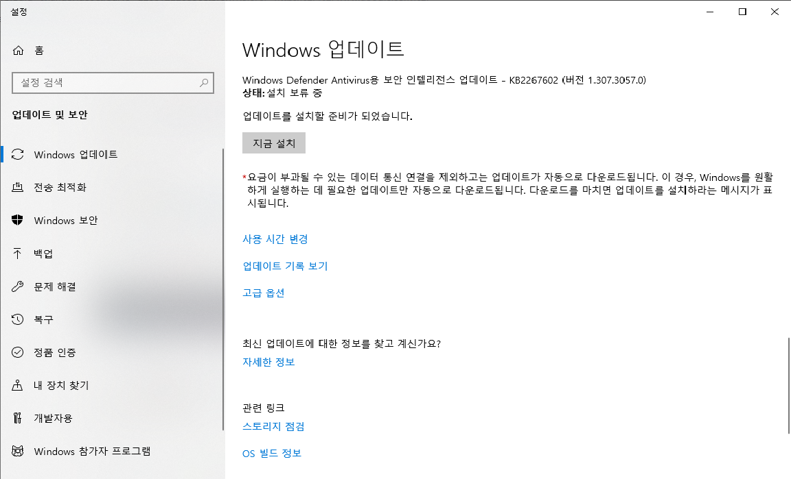
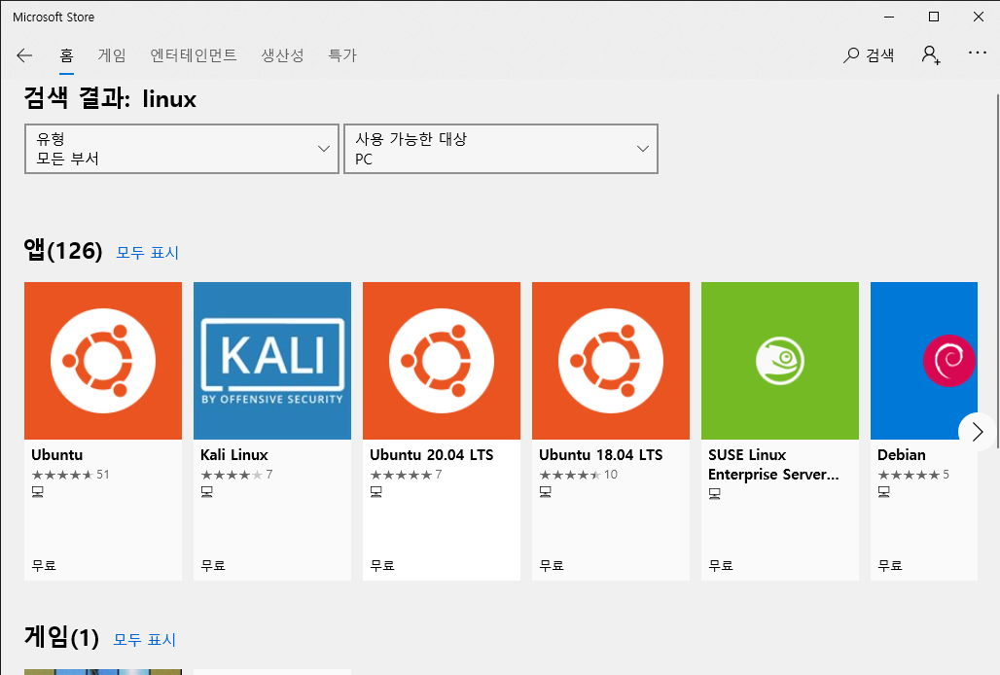

Docker를 이용하기에 앞서 Docker를 설치하는 방법에 대한 포스팅을 하려고한다.
블로그를 작성하는 시점 기준으로 Linux와 Windows 10 Professional은 설치가 매우 쉽다. 하지만 Windows 10 Home를 사용하는 PC의 경우에는 해당 PC에 사전 작업을 몇가지 해줘야 한다. 이 포스팅은 Windows 10 Home 사용자를 기준으로 설치법 가이드를 진행한다. (해당 설치는 https://www.44bits.io/ko/post/wsl2-install-and-basic-usage 블로그의 방법을 따라서 진행했다)

## WSL2 설치
### WSL 이란
Windows Subsystem for Linux의 약자로서, Windows 10이 도입되면서 Windows 안에 Linux를 실행가능하게 해주는 시스템이다. WSL2는 WSL을  개선한 것으로 2020년 Windows 업데이트에서 사용할 수 있으며, 이를 이용해 Docker for Windows를 Windows Home에도 사용할 수 있게 된다.

### 설치하기
위에서 언급했듯이 WSL2 기반으로 운영할 예정이기 때문에 WSL2를 먼저 설치해야한다. Windows 2020년 5월 업데이트 이후부터 사용할 수 있기 때문에 해당 버전보다 아래인지 확인해보고 업데이트를 맞춰줘야한다.

#### WSL을 설치하기 위한 활성화
<CODE>
dism.exe /online /enable-feature /featurename:Microsoft-Windows-Subsystem-Linux /all /norestart
dism.exe /online /enable-feature /featurename:VirtualMachinePlatform /all /norestart
</CODE>
WSL 설치하기에 앞서 설치를 할 수 있게 위와 같은 명령어로 활성화를 해준다.

#### WSL용 리눅스 설치
활성화한 후에 윈도우 키를 누르고 검색으로 Microsoft store를 입력하여 스토어 창을 켠다. 그리고 linux를 검색하면 설치할 수 있는 리눅스들이 나오는데 이중에서 본인은 ubuntu를 선택하여 진행한다.

어느 정도 시간이 흐른 후, 커맨드 창에 사용자 이름과 패스워드를 입력하라고 하는 입력하면 우분투가 설치 완료가 된다.