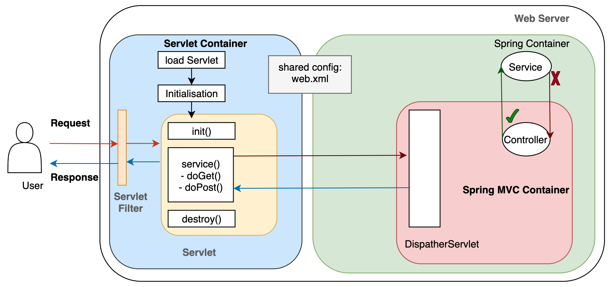

Spring에선 요청이 어떻게 들어와서 어떻게 처리되는지 프로세스에 대한 것을 확인해본다.

### 제어 역전(Inversion of Control)
스프링 프레임워크는 자바에서 웹개발을 돕기위한 프레임워크로 제어 역전이란 개념을 지니고 있다. 이전의 개발은 개발자가 프로그램의 흐름을 제어하며 객체의 라이프사이클을 관리하였다. 하지만 이 제어 역전 개념에선 개발자가 객체의 라이프사이클을 관리하는 것이 아닌, 프레임워크에서 주도적으로 관리하고 개발자는 이를 그냥 사용하는 방식이다. 스프링 프레임워크에선 IoC 컨테이너가 IoC 개념을 수행하며, 이를 통해 DI(Dependency Injection)을 이용할 수 있다(ex)@Autowired).

참고로 DI를 할 경우 Field Injection은 나쁜 패턴이라 하는데 이는 차후 DI를 돌아보며 정리하도록 한다.

### AOP(Aspect Oriented Programming)
관점 지향이라고 하는 이 개념은 스프링에서 제공해주는 기능으로, 어떤 로직을 기준으로 핵심적인 관점, 부가적인 관점으로 나누어서 보고 그 관점을 기준으로 각각 모듈화해주는 관점이다.
흩어진 관점들을 모아서 한곳에서 실행할 수 있게 해주는 개념으로 이 개념도 차후 살펴보며 정리하도록 한다.

### PSA(Portable Service Abstraction)
사용하는 라이브러리의 클래스를 직접 가져다가 쓰는 것이 아니라, POJO(Plain Old Java Object)를 이용하여 객체지향적인 특성을 살려 구현을 하고, 라이브러리의 기능을 이용할 수 있게 추상화를 해주는 개념을
스프링에서 제공해준다. 예를 들어 스프링에선 서블릿 어플리케이션을 만들지만, 개발자가 직접 서블릿을 제작하는 일은 없다. 이는 PSA를 통해 컨트롤러 등을 서블릿으로 만들어주는 작업을 스프링에서 하고있다는
것이다. 이 개념도 차후 정리하도록한다.

### 구조
위와 같이 3가지 스프링의 특성을 확인했다. 이와 같은 제공하는 스프링의 구조는 아래의 그림과 같다.

기능을 제공하기위해 스프링에선 20여개 정도의 모듈로 구성되어있으며 크게 Core Container, Data Access/Integration, Web, AOP, Instrumentation, Test 부분으로 나뉘어져 있다.

#### Core Container
Core Container는 Core, Beans, Context, Expression Language 모듈들로 이루어져있다.

Core와 Beans는 IoC와 DI 등 프레임워크의 핵심 기능을 제공해주는 모듈들로, 팩토리 패턴으로 구현된 BeanFactory 클래스가 싱글톤 패턴의 필요성을 없애주며 프로그램 로직을 구현할 수 있게 해준다.

Context 모듈은 resource bundle을 지원하여 다국어 기능을 지원하고, 이벤트 전파, 리소스 로딩 등을 지원한다. AppplicationContext 인터페이스는 Context 모듈의 중점이다.

Expression Language 모듈은 JSP에서 EL을 사용할 수 있게하는 기능 등을 제공한다.

#### Data Access/Integration
Data Access/Integration 레이어는 JDBC, ORM, OXM, JMS, Transaction 모듈들로 이루어져있다.

JDBC 모듈은 JDBC 관련 코딩을 해야하는 필요성을 제거해주는 JDBC 추상화 계층을 제공한다.

ORM 모듈은 JPA, JDO, Hibernate 등 Object-relational 매핑 API를 제공한다.

OXM 모듈은 Object/XML 매핑의 추상화를 제공한다.

JMS(Java Messaging Service) 모듈은 메시지를 생성 및 소비하는 기능을 제공한다.

Transaction 모듈은 POJO를 이용하여 트랜잭션을 관리할 수 있는 인터페이스들을 직접 구현한 클래스들을 제공한다.

#### Web
Web 레이어는 Web, Web-Servlet, Web-Struts, Web-Portlet 모듈들로 구성되어있다.

Web 모듈은 multipart 지원 및 IoC 컨테이너, application context를 초기화하는 기능을 제공한다.

Web-Sevlet 모듈은 MVC 패턴을 구현하는 구현체를 포함하고있다.

Web-Struts 모듈은 Struts클래스들을 지원하는 기능을 제공한다.

Web-Portlet 모듈은 포틀릿 환경을 지원하고 Web-Servlet 모듈의 기능을 mirror(복제?)한다. Portlet이 무엇인지 차후 알아보도록한다. 

#### AOP와 Instrumentation
AOP 계층은 AOP 프로그래밍을 할 수 있도록 기능을 지원한다.

Instrumentation 계층은 어플리케이션 서버에 사용되는 클래스로더 구현체와 클래스 instrumentation 등을 제공한다. 

#### Test
Test 모듈은 JUnit과 TestNG의 테스팅 컴포넌트들을 지원한다.

참고
- https://docs.spring.io/spring-framework/docs/3.0.x/spring-framework-reference/html/overview.html
- https://dailyworker.github.io/spring-triangle/
- https://www.vojtechruzicka.com/field-dependency-injection-considered-harmful/
- https://engkimbs.tistory.com/746
