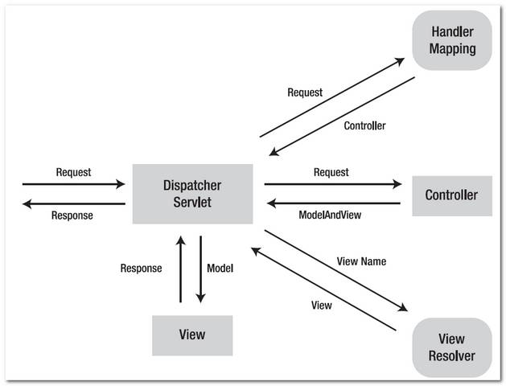

Spring에선 요청이 어떻게 들어와서 어떻게 처리되는지 프로세스에 대한 것을 확인해본다.

### 전체적인 구조
Spring MVC를 사용할 땐 내장톰캣이 없기때문에 따로 웹서버를 띄우고 그 서버에 웹 어플리케이션을 띄우는 구조이다.
Spring boot의 경우도 내장 톰캣을 웹서버로 띄우는 구조이기때문에 비슷하게 이해하면 될 것 같다.

상단의 그림이 톰캣 기반의 웹서버에서 실행되는 스프링의 요청 처리 구조이다.
먼저 웹서버에 클라이언트의 요청이 들어오게 되면, 서버에서 Request 분석을 해서 처리해야되는 애플리케이션에 Request를 넘겨주게 된다.
이 넘겨주는 Request를 스프링 컨테이너가 받게 되는데 이때 DispatcherServlet이라는 객체가 Request를 받게된다.
DispatcherServlet은 앞에서 요청을 받아서 적절한 처리를 하기 때문에 Front Controller라고도 부른다고 한다.

DispatcherServlet이 요청을 받아서 처리할 컨트롤러에 넘겨주면 컨트롤러는 서비스를 호출해서 비즈니스 로직으로 처리를 한 후 결과를 반환하면,
이를 Response로 반환하여 웹서버에서 클라이언트로 다시 돌려주는 구조이다.

### Spring 내부 구조
전체적인 구조를 확인했으니 Spring의 내부 구조를 상세히 살펴본다.

Spring 내부에 동작하는 개념은 아니지만 Filter에서 먼저 Request를 거른다. 인증 실패, 올바르지 않는 url 등등이면 Filter단에서 한번 거르고,
Spring에 Request를 보내는데 이때 Dispatcher Servlet이 Request를 받아서 처리를 한다.Dispatcher Servlet이 받아서 올바른 컨트롤러에 Handler
Mapping을 하기 전에, Interceptor가 Request를 읽는다.
그 이후에 Handler Mapping을 하고 컨트롤러 단에 보내는데 그 전에 AOP에서 한번 더 Request를 읽을 수 있다. AOP는 Spring에서 제공하는 개념으로
차후에 상세히 본다.

즉 정리를 하자면 웹서버단의 Filter에서 출발해서 Interceptor -> AOP -> Controller 순으로 요청이 전달되면서 처리된다.

### Dispatcher Servlet 동작 과정
Dispatcher Servlet이 내부에서 동작하는 과정을 살짝 추가해본다.

위와 같이 처리과정이 있는데, 일단 Request가 들어오게되면 맞는 컨트롤러를 찾기위해 Handler Mapping을 한다. 이 사이에 Interceptor가 동작한다고
생각하면 된다. 그리고 매핑이 끝나 맞는 컨트롤러를 찾게되면 컨트롤러에 Request를 전달한다. 이 사이에 AOP가 있다고 보면된다.
Request를 전달해서 컨트롤러가 처리를 하면 해당하는 ModelAndView를 반환한다. Dispatcher Servlet은 전달받은 내용을 View Resolver에 다시 전달하여 
Request에 반환할 화면을 찾는다. 만약 @RestController라면 이작업을 생략하고 JSON 데이터를 반환한다.
결과적으로 Request에 맞는 화면을 Response로 반환을 하게 된다.

이와 같이 웹서버에서 웹 애플리케이션으로 Request가 넘어오는 과정과, Spring 내부에서 Request를 처리하는 과정을 간략히 살펴봤다.

참고
- https://mossgreen.github.io/Servlet-Containers-and-Spring-Framework/
- https://sallykim5087.tistory.com/158
- https://www.stechstar.com/user/zbxe/JSPWebProg/53384