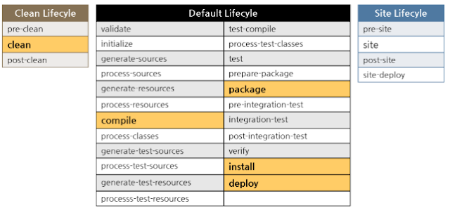
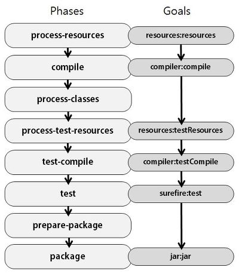

프로젝트를 빌드할 때 사용되는 메이븐의 라이프 사이클과 페이즈에 관련해서 개념을 알아본다.

### 라이프 사이클
메이븐에서 라이프 사이클이란 미리 정해진 빌드 순서를 의미한다.
메이븐에선 미리 정해진 빌드 순서인 몇가지 라이프 사이클을 제공한다.

#### Clean
Default 라이프 사이클을 수행하여 만든 산출물을 제거하는 라이프 사이클이다.

#### Default
소스코드를 컴파일하고 결과물을 만들어내는 라이프 사이클이다.

#### Site
프로젝트의 설명 사이트를 만드는 라이프 사이클이다.

### 페이즈
라이프 사이클을 이루고 있는 각각 단계를 페이즈라고 한다.
페이즈간에는 의존관계가 있어, 한 라이프 사이클에서 이전 단계의 페이즈가 수행이 되어야지만이 다음 단계의 페이즈를 수행하게된다.

참고
- http://itnovice1.blogspot.com/2018/12/mvn-lifecycle.html