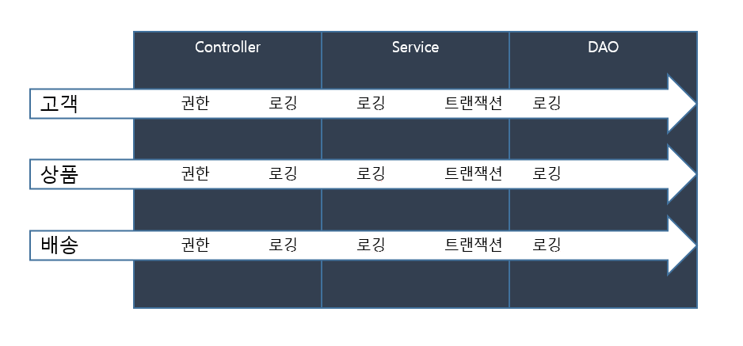
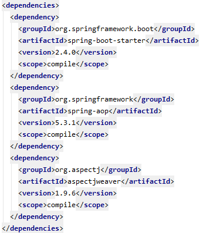

Spring에서 제공하는 개념인 AOP를 자세히 살펴보고, Spring boot에서 직접 적용해본다.

### 개념
AOP란 Spring에서 제공하는 개념으로 Aspect Oriented Programming의 약자이다.
Spring에서 어플리케이션을 구현하다 보면 Controller -> Service -> Model 순으로 흐름이 흘러가는데 구현을 하다보면, 
각 레이어별로 비즈니스 로직이 아닌, 권한이나 로깅 등 부수적인 기능을 추가해야하며 이는 여러 부분의 클래스에서 공통적으로 나타날 수 있다.
이러한 공통적인 부분들을 처리하기위해 AOP란 개념을 제공한다.

이해가 가기 쉽게 예시 그림을 다른 블로그에서 차용하여 설명한다.



위의 그림과 같이 Spring에서 서비스를 구현할 경우, 권한이나 로깅, 트랜잭션 등 각 클래스들에서 공통적으로 처리하는 부분이 꽤 많이 생긴다.
이러한 공통적인 부분들은 사실 중요한 비즈니스 로직이 아니고, 계속 겹치는 부분이기 때문에 OOP 관점에서도 별로 좋지않고 불필요한 코드들이 늘어나게 된다.
따라서 AOP 개념을 통하여 이를 개선한다.

### 용어
* Aspect : 애플리케이션 내 여러 곳에 흩어져 있는 코드나 기능을 의미. 쉽게 말하면 로깅 등 여러 객체에서 공통으로 겹치는 기능들을 의미한다.
* Joinpoint : 프로그램이 실행 중일때 발생하는 메서드 실행, 생성자 호출, 필드 값 변경과 같은 특수한 지점을 의미한다.
* Advice : AOP가 적용되는 객체의 Joinpoint에 실행되는 Aspect의 실제 동작 코드를 의미한다.
* Pointcut : Joinpoint의 정규 표현식을 의미한다.
* Weaving : Advice를 객체에 삽입하는 동작을 의미한다.

### Spring AOP와 AspectJ의 차이점
간략히 설명하자면 Spring에서 기본 제공하는 Spring AOP는 런타임시에 weaving을 하는 프레임워크라고 보면된다. 그래서 다른 컴파일러나 별다른 
라이브러리를 가져다 쓸 필요는 없지만, 대신 런타임에 동작하기 때문에 성능에 영향을 주고, 제약사항 또한 많다.
반면 AspectJ는 Spring의 기본 기능이 아니기 때문에 다른 라이브러리들을 import 해줘야하지만 컴파일 시점에 weaving을 해주기 때문에 성능 측면에 영향을
덜 주며 제약사항 또한 적다.

상세한 비교사항은 [이곳](https://logical-code.tistory.com/118)을 참조하길 바란다.

### Spring boot에서 AspectJ 적용하기
기본적으로 제공하는 Spring aop는 런타임 시점에 적용하기 때문에 성능 측면에 영향을 많이 주게된다.
따라서 AspectJ를 적용하는 방법을 알아보고자 한다.

#### 의존성 적용
```
<dependency>
    <groupId>org.springframework.boot</groupId>
    <artifactId>spring-boot-starter-aop</artifactId>
</dependency>
```
Spring boot에서는 starter 의존성을 제공하여 aop 관련해서 의존성을 편하게 사용할 수 있게한다.

이 의존성을 한번 더 들어가보면

spring aop와 aspectJ 의존성이 담겨있는 것을 확인할 수 있다.

#### AOP 활성화 하기
Spring boot의 main 클래스에 @EnableAspectJAutoProxy 을 추가하여 AOP를 사용할 수 있게 설정한다.

#### 코드 작성
@Aspect와 @Component 를 정의할 클래스 상위에 작성하고, 실제로 적용할 코드를 작성한다.
예시 코드는 [여기](https://jeong-pro.tistory.com/171)에 있는 코드이다.

```
@Aspect
@Component
public class LogAspect {
    Logger logger =  LoggerFactory.getLogger(LogAspect.class);
    
    //BookService의 모든 메서드
    @Around("execution(* com.example.demo.service.BookService.*(..))")
    public Object logging(ProceedingJoinPoint pjp) throws Throwable {
        logger.info("start - " + pjp.getSignature().getDeclaringTypeName() + " / " + pjp.getSignature().getName());
        Object result = pjp.proceed();
        logger.info("finished - " + pjp.getSignature().getDeclaringTypeName() + " / " + pjp.getSignature().getName());
        return result;
    }
}
```

### 마무리
이번 포스트를 통해 AOP의 개념과 스프링에 직접 적용하는 방법을 찾아보았다. AOP의 기능을 잘 활용하여 OOP 관점의 코드를 더 잘 구현하길

참고
- https://logical-code.tistory.com/118
- https://congsong.tistory.com/25
- https://jeong-pro.tistory.com/171