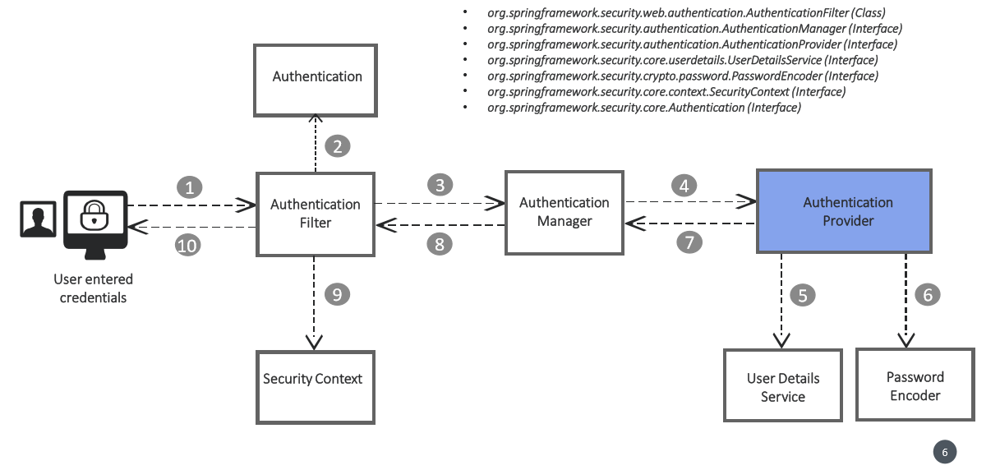

modelMapper보다 좀 더 사용하기 좋다고 판단한 Mapstruct의 사용법을 정리하고자 한다.

### 설정
메이븐에 의존성 설정을 해준다.
```
    <dependency>
        <groupId>org.mapstruct</groupId>
        <artifactId>mapstruct</artifactId>
        <version>1.4.2.Final</version>
    </dependency>
```

그리고 컴파일 시점에 매핑하는 코드를 컴파일해서 생성하기 때문에 메이븐 컴파일러 플러그인이 추가되어있지 않으면 추가를 하고, 어노테이션 프로세서 설정을 해준다.
```
    <plugin>
        <groupId>org.apache.maven.plugins</groupId>
        <artifactId>maven-compiler-plugin</artifactId>
        <version>3.6.2</version>
        <configuration>
            <source>1.8</source>
            <target>1.8</target>
            <annotationProcessorPaths>
                <path>
                    <groupId>org.projectlombok</groupId>
                    <artifactId>lombok</artifactId>
                    <version>1.18.16</version>
                </path>
                <!-- This is needed when using Lombok 1.18.16 and above -->
                <path>
                    <groupId>org.projectlombok</groupId>
                    <artifactId>lombok-mapstruct-binding</artifactId>
                    <version>0.2.0</version>
                </path>
                <!-- Mapstruct should follow the lombok path(s) -->
                <path>
                    <groupId>org.mapstruct</groupId>
                    <artifactId>mapstruct-processor</artifactId>
                    <version>1.4.2.Final</version>
                </path>
            </annotationProcessorPaths>
        </configuration>
    </plugin>
```

* 위의 코드를 보면 mapstruct뿐 아니라 lombok관련 설정이 들어있음을 확인할 수 있다. lombok을 사용하지 않을 경우는 상관없으나, lombok을 프로젝트에서 사용할 경우, mapstruct에서 get/set에 컴파일 하기 전에 접근할 경우, symbol not found가 뜨기 때문에 mapstruct가 컴파일 되기전 lombok이 수행될 수 있게 설정해야한다.


### 일반적인 코드
ModelMapper와 마찬가지로 자바에서 객체 간 매핑에 대한 코드를 자동으로 생성해주는 매핑 라이브러리이다. 다른 점이라면, Annotation Processor를 사용하여 런타임이 아니라 컴파일 시, 매핑코드를 생성해준다.


### 구조


spring security의 동작 구조는 상단과 같다.
1. 클라이언트에서 어플리케이션으로 request가 오게 되면 Authentication Filter가 이 request를 가로챈다.
2. 가로챈 request를 사용자 관련한 인증 정보 객체로 변환을 한다(ex) 사용자 + 비밀번호).
3. 변환된 인증 정보 객체를 Authentication Manager에게 전달한다. Authentication Manager는 적절한 Provider를 선택해서 인증하는 관리자이다.
4. Authentication Manager가 적절한 Authentication Provider를 선택해서 인증을 수행하게 한다.
5. User Details란 사용자 정보가 어떻게 담겨있는지를 나타내는 인터페이스이다.
6. 패스워드 인코딩을 하는 객체이다.
7. 인증 정보를 다시 역전파한다.
8. 인증 정보를 다시 역전파한다.
9. 인증 정보를 security context로 넘긴다. (Spring container에 올라가있는 Security context). Security Context는 인증된/인증되지 않은 사용자 정보를 저장한다.

### 동작 구현
Spring boot에서 Spring security를 적용할 경우, 일반적으로 Spring-boot-starter-security 같은 디펜던시를 pom.xml에 추가하여 의존성관리를 간편하게
하는 측면이 있다. 이 의존성을 임포트할 경우, 아무런 옵션을 주지 않아도 security가 활성화 되어 모든 api에 인증 헤더를 넣지 않을 경우 401 status code를
return하게 된다. 하지만 모든 api에 security를 적용하지 않고 인증하지 않은 사용자도 사용 가능하게 할 수 있기 때문에 커스텀 동작을 할 수 있게 구현을 하고자 한다.

#### 설정 작성
1. 어노테이션 부여 : 새로운 클래스를 작성한 후, @Configuration을 붙여서 설정파일이란 것을 명시한다.
2. 상속 : WebSecurityConfigurerAdapter 클래스를 상속하여 Security 관련 설정을 할 수 있게 한다.
   * WebSecurityConfigureAdapter클래스를 파고 들어보면, configure라는 메소드가 있고 코드를 보면 모든 request에 대해서 검증을 해야되는것이 기본 옵션임을 확인할 수 있다.
  ```
    protected void configure(HttpSecurity http) throws Exception {
        this.logger.debug("Using default configure(HttpSecurity). If subclassed this will potentially override subclass configure(HttpSecurity).");
        http.authorizeRequests((requests) -> {
            ((AuthorizedUrl)requests.anyRequest()).authenticated();
        });
        http.formLogin();
        http.httpBasic();
    }
  ```
3. url 별 권한 설정 : WebSecurityConfigurerAdapter에서 configure를 통해 http 모든 요청에 대해서 인증을 해야지만 사용할 수 있게 했다. 이 메소드를 오버라이딩하여 url별 접근 권한을 설정한다.
```
@Override
    protected void configure(HttpSecurity http) throws Exception{
        http
                .authorizeRequests()
                    .antMatchers(HttpMethod.POST, "/test1").authenticated()
                    .antMatchers(HttpMethod.POST, "/test2").permitAll()
                    .anyRequest().denyAll()
                .and().formLogin()
                .and().httpBasic()
                .and().csrf().disable();
    }
```
위의 코드에서 .authorizeRequests()는 request에 대한 검증을 한다는것이고 .antMatchers는 url의 정규표현식 매칭을 통해, 파라미터에 해당하는 url을 찾아내는 것이고 뒤에 authenticated가 붙으면 인증을 해야지 해당 url을 사용 가능, .permitAll일 경우 모든 사용자 허용을 의미한다. .denyAll 부분은 위의 request를 제외한 모든 request를 인증여부와 관계없이 거부 하겠다는 의미이다. formLogin은 폼으로 로그인 하는 화면 관련 설정이고, httpBasic은 basicAuth를 사용할 수 있게하는 메소드이다.
csrf disable한 이유는 postman을 통해 테스트를 할 시, POST 메소드가 동작하지 않아 설정했다.

* 유의사항 : 만약 같은 강좌를 듣고 있는 사람이 있다면, ComponentScan에 해당 설정클래스의 패키지를 등록하지 않으면 @Configuration 어노테이션을 등록해도 설정 파일이 동작하지 않는다. 왜냐하면 Main 클래스의 패키지의 레벨이 다른 패키지들과 동일하여 등록하지 않을 경우 스캔하지 않기때문이다. 본인의 경우는 그냥 Main클래스를 위의 패키지로 이동해서 따로 스캔하라고 등록하지 않아도 알아서 스캔하게 설정을 했다.

금일의 포스팅은 여기까지

참고
- spring-security-zero-to-master