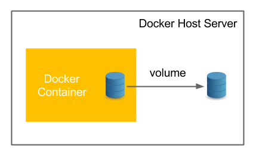

Docker를 진행하기에 앞서 Docker란 무엇인가에 대해 살펴본다.

### Docker란
Docker라는 단어에 대해서 여러번 들어봤지만 다시 한 번 이것이 무엇인지 정의하고 학습을 진행하도록 한다. Docker란 '컨테이너 기술을 사용하여 프로그램을 쉽게 배포하고 운영할 수 있게 해주는 오픈소스 플랫폼'이라고 생각할 수 있다.

#### 컨테이너
위에서 언급했듯이 컨테이너 기술을 이용했다고 하는데 이 컨테이너란 무엇인가를 짚고 넘어갈 필요가 있다. 이 컨테이너라고 함은 리눅스에서 많이 접할 수 있는데 리눅스 컨테이너는 단일 리눅스 시스템에 동작하고 프로세스를 격리시켜서, 각 프로세스마다 독자적인 리눅스 시스템 환경을 구축하는 것이라고 한다. 즉 OS의 커널은 프로세스마다 공유를 해서 프로세스마다 커널이 존재하는 것은 아니지만, 프로세스별로 컨테이너가 되어서 각자 시스템 환경을 구축하고 있다는 소리이다. 이를 단순히 표현하자면 OS 수준에서의 가상화라고 한다.

그렇다고 해서 리눅스 컨테이너와 Docker의 컨테이너 개념이 같냐 라고 묻는다면 그건 다르다.

#### LXC VS Docker
1. 구조적 차이
  리눅스의 컨테이너는 OS와 거의 동일하게 동작을 하기 때문에, 여러 어플리케이션이 하나의 컨테이너에 올릴 수 있다. 반면에 Docker는 하나의 어플리케이션을 하나의 컨테이너로 사용하게끔 설계되어있다. 
  

2. 데이터 저장 여부
  리눅스의 컨테이너는 독자적인 시스템 환경이라고 언급했듯이, 해당 컨테이너의 프로세스에서 사용하는 데이터들은 전부 해당 컨테이너에 저장이 된다. 반면에 Docker의 데이터는 컨테이너에 저장되지 않는다. 데이터를 어떻게 유지하냐 라고 하면 Docker의 Volume 개념이 있어서 Volume을 컨테이너에 바인드시켜서 데이터를 사용한다.

  

#### Docker VS VM
Docker와 VM의 차이점에 대해서 살펴보면 VM같은 경우는 본인 컴퓨터의 OS위에서 Hypervisor를 이용해 가상화한 OS를 위에 올리고, 이 OS위에 다시 어플리케이션을 올리는 개념이다. 즉 OS 위에 OS가 올라가서 Overhead가 꽤 크다. 반면에 Docker의 경우 OS위에 Docker Engine이 올라가고, 이 위에 어플리케이션이 묶인 컨테이너들이 올라가는 구조적 차이가 있다. 즉 OS위에 OS가 올라가는지 안올라가는지의 차이가 있다

#### 동작 원리

해당 동작 원리는 Docker관련 유튜브 영상을 보고 요약한 부분이다. 구조는 상단의 그림과 같다. 먼저 Docker 엔진을 통해서 컨테이너들이 관리가 되는데, Docker 엔진은 클라이언트와 서버가 있으며, 이들이 각각 REST API를 통해 통신을 한다. 엔진의 클라이언트는 사용자의 command를 체크해서 커맨드 기반으로 REST API를 서버에 호출한다. 서버는 해당 REST API를 읽어서 요청에 맞는 컨테이너/이미지 관리를 한다.

#### Layer

참고
- https://www.redhat.com/ko/topics/containers/whats-a-linux-container
- https://www.redhat.com/ko/topics/containers/what-is-docker
- https://medium.com/extales/%EB%A6%AC%EB%88%85%EC%8A%A4-%EC%BB%A8%ED%85%8C%EC%9D%B4%EB%84%88-linux-containers-lxc-%EC%97%90-%EB%8C%80%ED%95%B4%EC%84%9C-%EC%95%8C%EC%95%84%EB%B3%B4%EC%9E%90-132dde6331f8
- https://laptrinhx.com/docker-vs-lxc-lxd-what-s-the-best-for-your-website-3453457212/
- https://archives.flockport.com/lxc-vs-docker/
- https://chacha95.github.io/2020-08-08-Docker_Kubernetes1/
- https://youtu.be/rOTqprHv1YE