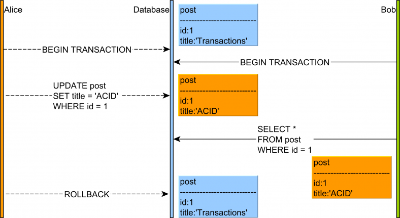
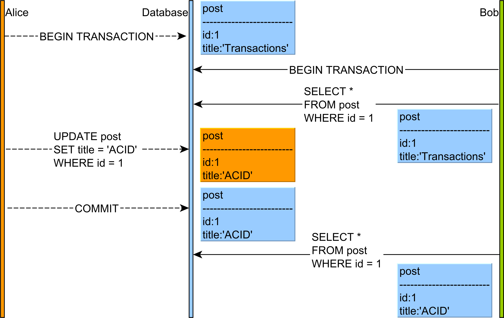
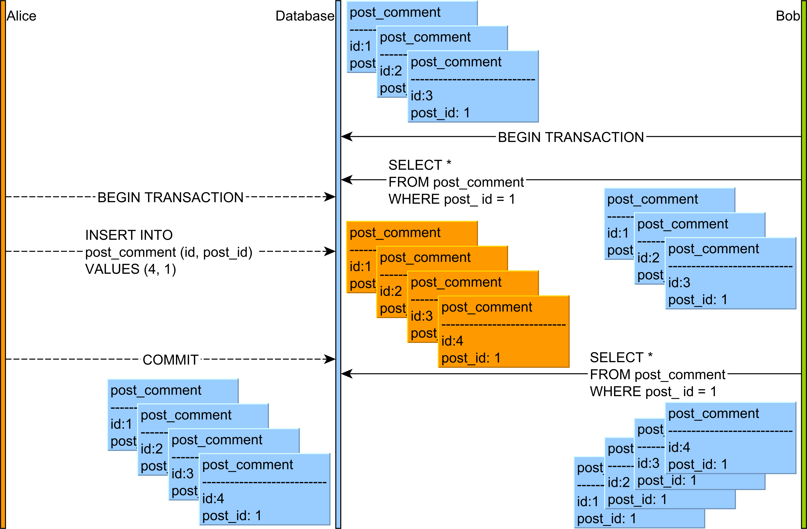

스프링에서 사용하는 Request 관련 어노테이션의 처리 방법들과, JPA를 사용했을 경우에 해당하는 트랜잭션 관련한 부분을 복습해보며, JPA를 사용했을 시 필요에 의해 오버라이드 했던 equals와 hashcode 관련 정리도 해본다.

### @Controller와 @RestController
일반적으로 http 요청을 처리하기 위해서 @Controller와 @RestController 어노테이션을 이용하여 컨트롤러를 구현하고, 여기에 서비스를 호출하여 비즈니스 로직을 처리한다.


위의 경우는 @Controller 어노테이션을 이용하여 컨트롤러를 구현하였을 경우 스프링 내부에서 처리하는 방식이다. 클라이언트가 http 요청을 했을 경우, Dispatcher Servlet은 이 요청에 맞는 컨트롤러를 찾기 위해 HandlerMapping을 하고, 컨트롤러에 요청을 넘겨서 컨트롤러가 비즈니스 로직을 처리한 후, 랜더링을 하기 위한 모델과 뷰를 Dispatcher Servlet에 반환한다. Dispatcher Servlet은 이를 받아 View Resolver에 뷰 이름을 전달하여 해당하는 뷰를 반환받고, View에 모델을 적용하여 페이지를 생성하여 Response로 반환한다.


위의 경우는 @RestController 어노테이션을 이용하여 컨트롤러를 구현하였을 경우 스프링 내부에서 처리하는 방식이다.
@RestController는 @Controller 어노테이션 + @ResponseBody 어노테이션이 결합한 것이라 생각하면 된다. 페이지를 반환하는 것이 아니라 단순 데이터를 반환하고자 할 경우 사용한다고 보면 되는데, 클라이언트가 http 요청을 할 경우, Dispatcher Servlet이 이를 받아서 컨트롤러를 찾는다. 컨트롤러를 찾아서 요청을 넘길 경우, Controller에서 비즈니스 로직을 처리해서 Dispatcher servlet에 처리 결과를 반환하는데 이때 처리 결과는 @Controller의 일반 처리 결과와는 다르게 모델과 뷰가 아니라 데이터이다(물론 @ResponseBody를 이용하여 컨트롤러를 구현하였을 경우, 처리결과가 같음). Dispatcher Servlet이 처리결과를 받고, view를 찾을 때와는 달리 HttpMessageConverter에 결과를 전달하여 결과를 처리하고 이를 response로 반환한다. HttpMessageConverter는 타입에 따라 동작하는 MessageConverter가 다른데 일반 String일 경우 StringHttpMessageConverter가 동작하고, 객체를 JSON으로 반환하고자 할 경우,  MappingJackson2HttpMessageConverter가 동작한다. Xml일 경우는 일반적으로 Jaxb2RootElementHttpMessageConverter가 동작하는 것으로 보인다.


### @RequestMapping
@RequestMapping 어노테이션은 '이 요청이 들어왔을 경우 이 메소드로 처리해주세요'를 하기위한 어노테이션이다. 이 어노테이션엔 몇가지 파라미터가 있다.

- String[] value : 처리할 url을 정의하는 파라미터로, 여러개의 스트링을 넘길 수 있다. ANT 스타일 사용 가능하다.
  - ex) value="/post/**/comment" : /post로 시작하고 /comment로 끝나는 모든 endpoint를 처리. 
  - ex) value="/post/{postId}" : postId는 경로 변수를 의미하며, 이는 컨트롤러에서 @PathVariable을 이용하여 사용 가능.
- RequestMethod[] method : 해당하는 HTTP METHOD를 의미한다. GET, POST, PUT, DELETE, OPTIONS, TRACE가 있다.
- String[] params : request에 들어오는 파라미터가 이렇게 들어와야 처리한다라고 정의하는 부분이다.
  - params="test=A" : test라는 변수가 있고 값이 A여야지만이 처리
  - params="test!=A" : test라는 변수가 있고 값이 A가 아니어야 처리
  - params="test" : test라는 변수있으면 처리
  - params="!test" : test라는 변수가 없어야 처리
- String[] headers : 맞는 헤더가 들어왔을 경우 처리한다라고 정의하는 부분이다.
- String[] consumes : request의 body 타입이 여기에 해당될 경우 처리를 하겠다 라고 정의하는 부분이다.
  - consumes = MediaType.APPLICATION_JSON_UTF8_VALUE : content-type이 APPLICATION_JSON_UTF8_VALUE일 경우 처리를 한다고 정의하는 부분이다.
- String[] produces : response의 body 타입이 여기에 해당될것이며, accept 할경우 처리할 것이다 라고 정의한 부분이다.
  - produces = MediaType.TEXT_PLAIN_VALUE : accept가 TEXT_PLAIN_VALUE일 경우 처리를 한다고 정의하는 부분이다.

### Transaction
사전적인 정의로는 데이터베이스의 상태를 변화시키기 위해 수행하는 작업의 단위이다. 이 작업의 단위인 트랜잭션은 단순히 sql 한문장이 아니라 여러 문장을 담을 수 있다. 트랜잭션의 성질은 아래와 같이 4가지가 있다.

- 원자성(Atomicity)
  - 한 트랜잭션내에서 실행한 작업들은 하나로 간주하여, 전체 성공이면 성공, 하나라도 실패하면 실패로 처리
- 일관성(Consistency)
  - 트랜잭션은 일관성 있는 데이터베이스를 유지해야함
- 격리성(Isolation)
  - 다른 트랜잭션들이 서로 영향을 미치지 않도록 격리
- 지속성(Durability)
  - 트랜잭션이 끝나면 결과가 저장돼야함

이 트랜잭션이란 개념아래에서 발생할 수 있는 현상과 이를 Spring 내부에선 어떻게 해결하는지, 그리고 Spring 에서 설정할 수 있는 것들은 무엇이 있는지 확인해본다

#### 격리 수준에 따른 발생 가능 문제
- Dirty Read
  - 트랜잭션 A와 B가 동시에 일어나며, A가 값을 변경하고 commit 하기 전에, B가 접근했을 때 이 값에 접근해서 조회할 수 있는 문제이다.
  - A가 commit 하기전 값을 B가 접근해서 사용했는데, A가 롤백되면 값이 이전값으로 변경되기 때문에 데이터 불일치가 발생한다.
  - 
- Non Repeatable Read
  - 트랜잭션 A가 id 1이라는 객체를 조회해서 정보를 사용하고 작업을 진행하는 도중, 트랜잭션 B가 id 1의 객체 정보를 수정하고 커밋을 해서 DB의 정보가 바뀐상태에서 A가 다시 1에 대한 정보를 조회했을때 처음 조회했던 정보와 달라져서 더이상 같은 정보를 조회할 수 없는 현상이다.
  - 
- Phantom Read
  - 트랜잭션 A가 'id가 10이하' 라는 조건을 이용하여 1,2,3이라는 객체를 조회하고 이에 대한 작업을 수행하는데 트랜잭션 B에서 id 4를 커밋해서 A에서 다시 조회했을 시 결과가 변경되는 문제이다.
  - 

Non Repeatable Read는 단일 객체에 대해서 업데이트를 수행하면 발생할 수 있는 문제로, 트랜잭션이 조회할 때 해당 행에 lock을 걸면 발생하지 않지만, Phantom Read는 새로운 값이 삽입되었을때 범위조회의 결과가 변경되는 현상이기 때문에 업데이트를 막는 lock을 걸어도 예방을 할 수 없다.


#### POSTGRESQL의 TRANSACTION 확인
```
  SELECT * FROM pg_locks pl LEFT JOIN pg_stat_activity psa ON pl.pid = psa.pid;
```
위의 쿼리를 사용하면 POSTGRESQL에서 현재 진행되는 TRANSACTION의 상태, 락타입, 락의 대상, 트랜잭션에서 수행하는 쿼리들을 확인할 수 있다.

#### Spring Boot + JPA 에서의 TRANSACTION
스프링에서 트랜잭션의 관리를 어떻게 하는지 알아본다. 트랜잭션의 설정 부분은 Propagation과 Isolation, readOnly, 그리고 롤백 관련 설정이 있다. 이에 관련한 것들을 살펴본다. 

- isolation : 트랜잭션의 격리 레벨을 설정하는 부분이다. 아무것도 입력하지 않았을 경우 default로 설정되며 이는 각 DB의 isolation 레벨과 같다. Postgresql에선 READ COMMITTED이다.
  - READ_UNCOMMITTED : 커밋되지 않은 데이터에 대한 읽기를 허용하는 격리 레벨이다. 따라서 다른 트랜잭션에서 아직 커밋하지 않은 데이터에 대한 조회가 가능하며 커밋하다가 롤백이 되었을 경우 잘못된 데이터를 조회하는 Dirty Read가 발생한다.
  - READ_COMMITTED : 커밋한 데이터만 접근 가능한 격리 레벨이다. 커밋한 데이터는 접근 가능하기 때문에 트랜잭션중에 조회하다가 그 사이에 변경된 데이터를 읽어들이는 Non Repeatable Read문제는 발생이 가능하다.
  - REPEATABLE_READ : 트랜잭션이 완료될 때까지 조회한 데이터에 대해서 shared_lock이 걸려서 수정이나 삭제가 불가능한 상태이다. 다만 새로운 데이터는 추가 가능하기 때문에 Phantom read는 발생 가능하다.
  - SERIALIZABLE : 트랜잭션이 완료될 때까지 데이터 변경이 불가능한 격리레벨이다. 해당 격리레벨은 DB에서 처리하는 방식에 따라 다르지만 락을 테이블 전체에 거는 방법도 존재한다. 이 방식은 Deadlock이 발생할 수 있는데 왜냐하면 Transaction A에서 SELECT를 하고 B에서도 SELECT를 하면 둘 다 shared lock을 걸게 된다. 여기에서 INSERT 작업을 하고자 하면 Exclusive lock을 걸려고 시도하는데 A에서 Insert하려고 해도 B의 shared lock 때문에 실패하고 B에서 Insert하려고 해도 shared lock때문에 실패를 하게된다. 따라서 Dead lock이 발생하는 것이며 이러한 문제로 인해 해당 격리 레벨 사용할 시 주의해서 설계를 해야한다.


- propagation : 트랜잭션 도중에 다른 트랜잭션을 호출해야될 때 어떻게 행동할 것인지 설정하는 값이다. 아무 값을 설정하지 않으면 REQUIRED가 기본값이다.
  - REQUIRED : 기본적으로 자식 트랜잭션을 호출했을때, 부모에 트랜잭션이 있으면 부모 트랜잭션에서 실행하며, 부모가 없을 경우 새로운 트랜잭션을 만들어서 실행하는 설정이다.
  - REQUIRES_NEW : 부모 트랜잭션 유무에 상관없이 새로운 트랜잭션을 생성하여 실행하는 설정이다.
  - SUPPORS : 부모 트랜잭션에서 실행하며, 부모가 없을 경우 트랜잭션이 없이 실행하는 설정이다.
  - MANDATORY : 부모 트랜잭션 내에서 실행하며, 부모가 없을 경우 예외를 발생시킨다.
  - NOT_SUPPORT : 트랜잭션 없이 실행하며, 부모 트랜잭션이 호출한 경우 부모 트랜잭션을 일시 중지 시키고 본인을 실행시킴
  - NEVER : 트랜잭션 없이 실행하며, 부모 트랜잭션이 있을 경우 예외 발생
  - NESTED : 부모 트랜잭션이 있으면 그 안에서 트랜잭션을 만들어 실행하며, 부모가 없을 경우 새로운 트랜잭션을 만들어서 실행

여기서 헷갈리는 점은 REQUIRES_NEW와 NESTED이다. 부모 트랜잭션이 있을 경우 새로운 트랜잭션을 만드는 속성이 비슷해보이는데 차이점이라고 함은 REQUIRES_NEW같은 경우, 생성하는 트랜잭션은 본인이 실패해도 부모에게 영향을 주지 않으며 부모가 실패해도 본인이 영향받지 않는다. 반면에 NESTED의 경우, 생성한 트랜잭션 본인의 커밋과 롤백에 대해선 부모 트랜잭션에 영향을 주지 않지만 부모의 트랜잭션이 롤백되었을 경우 본인도 롤백을 해야한다.

- readOnly : 

- 롤백
  - 


참고
- https://mangkyu.tistory.com/49
- https://joont92.github.io/spring/@RequestMapping/
- https://2ham-s.tistory.com/292
- https://www.postgresql.org/docs/8.4/view-pg-locks.html
- https://goddaehee.tistory.com/167
- https://stackoverflow.com/questions/11043712/what-is-the-difference-between-non-repeatable-read-and-phantom-read
- https://vladmihalcea.com/dirty-read/
- https://taetaetae.github.io/2016/10/08/20161008/