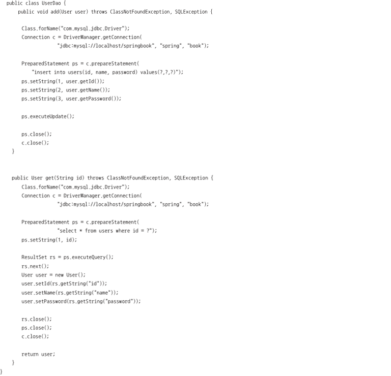
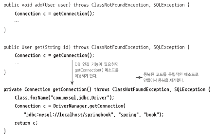
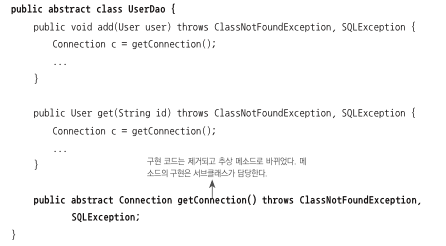
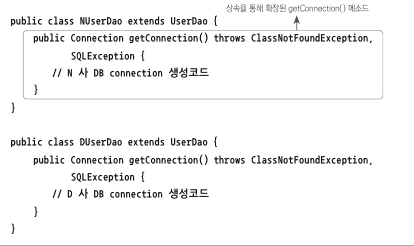
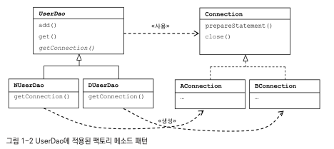
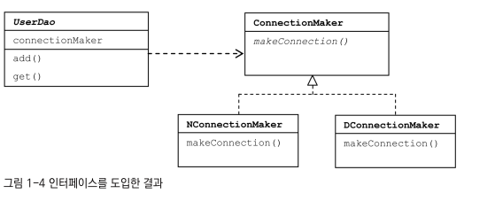
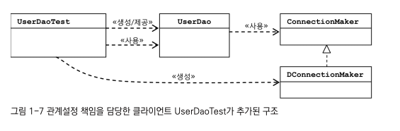
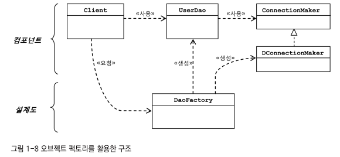
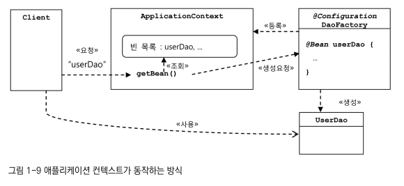

토비의 스프링을 읽고 이해한 내용을 바탕으로 요약한다.

### 오브젝트와 의존관계
#### DB 커넥션 기능 구현

DB를 연결하고 쿼리를 날려서 데이터를 가져오는 기능을 구현하면 이 모든 기능을 한 메소드에 넣고, 설정 값을 넣어서 특정 타입의 DB에 연결하는 코드를 구현 할 수 있다. 하지만 이렇게 구현을 하게 된다면 DB를 다른 제품을 사용한다거나 설정값이 달라지거나 했을 경우 영향을 받는 부분이 상당히 많아지기 때문에 유지보수 측면으로 봤을때 성능이 나쁜 코드가 된다. 이를 기능별로 분리해서 설계하는 방법을 살펴본다.

상단의 코드는 토비의 스프링 서적에서 작성된 코드이며, 사용자의 추가와 조회의 기능을 수행하는 메소드 두개가 구현되어있으며, 각 메소드에선 커넥션을 연결하고 쿼리를 수행하는 코드까지 한번에 구현되어있다.

프로그래밍의 기초 개념 중, 관심사의 분리라는 개념이 있는데 관심이 같은 것들끼리는 하나의 객체로, 또는 친한 객체로 모이게 하며 관심이 다른 것들은 가능한 따로 떨어져 서로 영향을 주지 않도록 분리하게 설계를 한다는 개념이다. 이 관점으로 봤을때 위의 코드는 다양한 기능이 한 곳에 담겨 있는 나쁜 코드라고 볼 수 있다.

해당 DAO의 관심사항은 크게 세가지로 나눌 수 있다.
1. DB와의 연결
2. 쿼리 수행
3. 리소스 관리

이 관심사를 기준으로 코드를 분리하는 방법을 살펴본다

##### 커넥션 분리

일단 커넥션 기능을 분리하는 관점에서 코드를 분리하자면 상단과 같이 구현을 할 수 있다.

하지만 이렇게 구현했을 경우, 다른 방법으로 커넥션을 가져와야한다면, 코드 수정이 불가피한 코드가 된다. 따라서 이를 연결하는 방법을 추상화하는 방법으로 제공을 하면 getConnection 부분은 그대로 가져가고 사용자가 필요한 방식으로 구현해서 클래스 구현을 완료하면 된다.

이런 식으로 구현을 하면 UserDao의 조회나 저장 방식과는 상관없이 connection 부분을 이용할 수 있으며, 각 사용자의 방식에 따라 connection을 구현하여 사용하면 된다. 이렇게 기능의 일부를 추상 메소드나 오버라이딩이 가능한 메소드로 만든뒤 서브클래스에서 구현하여 사용하는 방법을 템플릿 메소드 패턴이라고 한다. 그리고 또한 UserDao의 서브 클래스인 NUserDao와 DUserDao에서 Connection 객체를 어떻게 생성할지를 판단하고 생성하는 구조이기 때문에 팩토리 메소드 패턴을 적용한것이라고 볼 수 있다.

* 템플릿 메소드 패턴 : 알고리즘의 구조를 메소드에 정의하고 하위 클래스에서 알고리즘 구조의 변경없이 알고리즘만 재정의 하는 패턴이라고 보면 된다.

* 팩토리 메소드 패턴 : 팩토리 메서드 패턴(Factory method pattern)은 객체지향 디자인 패턴이다. Factory method는 부모(상위) 클래스에 알려지지 않은 구체 클래스를 생성하는 패턴이며. 자식(하위) 클래스가 어떤 객체를 생성할지를 결정하도록 하는 패턴이기도 하다. 부모(상위) 클래스 코드에 구체 클래스 이름을 감추기 위한 방법으로도 사용한다.

하지만 이렇게 분리를 한다고 하더라도, UserDao에서 Connection을 생성한다는 사실은 변하지 않는다. NUserDao 등에서 Connection 생성을 하기 때문에 하위 클래스에서 중복 로직이 있을 경우 중복코드를 작성해야 하며, abstract클래스로 생성하지 않고 body를 갖는 메소드로 기본 메소드를 구현한다 하더라도 java는 단일 상속만을 지원하기 때문에 여러가지 제약사항이 발생한다. 따라서 이를 해결하기 위해 연결 부분을 아예 분리한다.

UserDao안에 ConnectionMaker라는 클래스의 객체를 멤버로 넣어서 커넥션 생성을 해당 객체에 맡기며, 이 ConnectionMaker는 interface로써 필요에 따라 상속하는 Subclass를 생성하여 필드의 멤버 객체로 생성한다. 다시한번 팩토리 메소드 패턴을 사용하는 것이다. 하지만 현 구조에서는 UserDao가 ConnectionMaker 객체를 생성해야 하는 문제가 있다. 이 관계설정 책임을 분리하기 위해 외부에서 ConnectionMaker의 서브클래스 객체를 생성해서 멤버로 주입해주는 외부 클래스를 작성하는 방법으로 관계설정 책임을 분리한다.

* 객체지향 설계의 원칙(SOLID 원칙)

- 단일 책임의 원칙(Single Responsibility Principle) : 모든 클래스는 각각 하나의 책임만을 가져야 한다는 원칙이다.

- 개방 폐쇄의 원칙(Open-Closed Principle) : 클래스나 모듈의 확장에는 열려있어야 하고 변경에는 닫혀있어야한다.UserDao를 예로 들자면 DB 커넥션 부분은 인터페이스를 사용하여 열어 놓았고, add나 get 같은 본인이 수행하는 기능의 변경에는 닫혀있다. 이를 개방 폐쇄 원칙이라고 한다.

- 리스코프 치환 원칙(Liskov Substitution Principle) : 자식 클래스는 언제나 자신의 부모 클래스를 대체할 수 있다는 원칙이다. 즉 부모클래스가 들어갈 자리에 자식 클래스를 넣어도 동작에 문제가 없다는 것이다.

- 인터페이스 분리 원칙(Interface Segregation Principle) : 자신이 사용하지 않는 인터페이스는 구현하지 말아야 한다는 원칙.하나의 일반적인 인터페이스보다는 여러개의 구체적인 인터페이스가 낫다는 원칙.

- 의존 역전 원칙(Dependency Inversion Principle) : 변화하기 쉬운것, 또는 자주 변화하는 것보단 변화하기 어려운 것에 의존하는 원칙. 구현된 클래스보단 인터페이스나 추상 클래스와 관계를 맺으라는 원리

* 응집도와 결합도
- 응집도 : 모듈에 포함된 내부 요소들이 하나의 책임/목적을 위해 연결되어있는 정도. 높을수록 좋음. UserDao를 예로 들자면, Connection을 분리하지 않았을 경우, 사용자의 조회와 추가 기능에 변경이 생겼을 경우 수정해야하는 것 뿐만 아니라 DB의 커넥션관련 기능이 변경되어야 할 경우에도 UserDao가 변경되어야 한다. 반면에 수정하고 나선 사용자의 조회와 추가 기능의 변경이 생겼을 때만 수정하면 되기 때문에 높은 응집도를 가진 코드가 되었다.

- 결합도 : 다른 오브젝트/모듈과의 결합도를 의미하며 이는 낮을수록 좋음. 하나의 오브젝트가 변경이 일어날 때에 관계를 맺고 있는 다른 오브젝트에게 변화를 요구하는 정도라고 책에선 설명한다. 만약 Connection 관련 기능이 변경되어서 새로운 클래스를 생성해서 UserDao에서 사용해야 한다 하더라도, ConnectionMaker 인터페이스를 사용했기 때문에 코드 상에서 변경은 없으며, 추가적으로 UserDaoTest라는 클래스에서 ConnectionMaker의 서브클래스 객체를 생성해서 UserDao에 주입을 해주기 때문에 UserDao에 영향을 적게 주기 때문에 낮은 결합도를 지녔다고 볼 수 있다.

* 전략 패턴 : 자신의 기능에 따라서 필요한 알고리즘을 인터페이스를 통해 외부로 분리시키고, 필요에 따라 클래스로 구현해서 사용하는 패턴으로 UserDao의 최종형태가 이 패턴이라고 할 수 있다.

#### 애플리케이션 컨텍스트
UserDao의 Connection을 생성하여 필드에 세팅한후 UserDao 클래스의 객체를 생성하는 팩토리를 생성하면 다음과 같다.

일반적으로 오브젝트를 생성할 때 본인이 사용할 클래스를 선택해서 객체를 생성할 수 있는데 이 개념을 뒤집어서, 오브젝트가 자신이 사용할 오브젝트를 생성하지 않고 외부에서 주입해 주는 것을 제어 역전이라고 한다. 위와 같이 팩토리를 이용하여 UserDao에 ConnectionMaker를 주입해서 생성하면 이미 제어의 역전이 일어났다고 불 수 있다.

이제 스프링으로 넘어가서 스프링의 제어역전 현상을 알아보면, 스프링에서는 스프링이 제어권을 가지고 직접 만들어 관계를 부여하는 오브젝트를 빈이라고 한다. 이 빈의 생성과 관계설정과 같은 제어를 담당하는 것이 스프링에서는 빈 팩토리라고 부른다. 이를 확장한 개념이 애플리케이션 컨텍스트이다.

이전에 설계했던 UserDao를 빈으로 등록하고 싶으면 @Configuration이란 어노테이션이 달린 DaoFactory 클래스를 정의하고 UserDao 타입의 객체를 반환하는 메소드를 하나 선언한뒤, @Bean 어노테이션을 그 위에 달아주면 애플리케이션 컨텍스트에 빈으로 등록해서 사용할 수 있다.

이렇게 등록할 경우 빈으로 어떻게 사용할 수 있냐면, 사용자가 userDao라는 빈을 사용하고 싶다고 할 경우 애플리케이션 컨텍스트에 이름을 기반으로 한 빈을 요청하고, 이 빈을 애플리케이션 컨텍스트에선 @Configuration 기반으로 찾아서 등록되어있는 빈을 반환하는 구조이다.

이런 식으로 사용할 경우, 몇가지 장점이 있다고 한다.
1. 클라이언트는 구체적인 팩토리 클래스를 알 필요가 없다 - DaoFactory같은 클래스를 여러개 애플리케이션 컨텍스트에 설정으로 등록해서 사용한다고 해도, 클라이언트는 이를 알필요 없이 빈을 가져올 수 있다.
2. 애플리케이션 컨텍스트는 종합 IoC 서비스를 제공해준다 - 애플리케이션 컨텍스트는 관계설정만하는 것이 아니라, 오브젝트가 만들어지는 방식, 시점과 전략을 다르게 가져갈 수 있고 자동생성, 후처리 등의 다양한 기능을 제공하기 때문에 여러모로 편리하다고 한다.
3. 애플리케이션 컨텍스트는 빈을 검색하는 다양한 방법을 제공한다 - 빈의 이름을 이용해서 찾을 수 도 있지만 타입으로도 찾을 수 있고, 어노테이션이 달린 빈을 찾을 수 도 있다.

참고
- 토비의 스프링
- https://yaboong.github.io/design-pattern/2018/09/27/template-method-pattern/
- https://ko.wikipedia.org/wiki/%ED%8C%A9%ED%86%A0%EB%A6%AC_%EB%A9%94%EC%84%9C%EB%93%9C_%ED%8C%A8%ED%84%B4