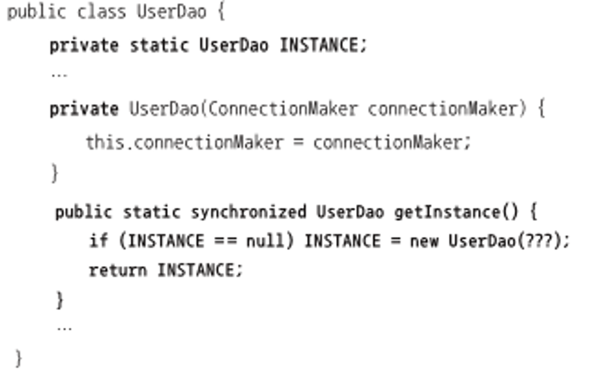
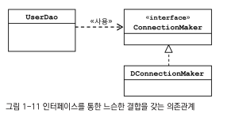
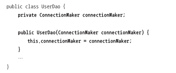
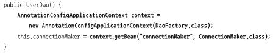

토비의 스프링을 읽고 이해한 내용을 바탕으로 요약한다.

### IoC
스프링의 제어 역전관점에서 사용하는 용어들은 다음과 같다.
- 빈 : 스프링이 제어역전으로 관리하는 오브젝트를 의미한다
- 빈 팩토리 : 스프링의 제어역전을 담당하는 핵심 컨테이너로써, 빈을 등록, 생성, 조회 반환하고 관리하는 기능을 담당한다.
- 애플리케이션 컨텍스트 : 빈 팩토리를 확장한 제어역전 컨테이너로써 빈 팩토리의 기능이외에 추가적으로 스프링이 제공하는 기능을 포함해서 얘기하는 것이라고 보면 된다.
- 설정 정보/설정 메타정보 : 애플리케이션 컨텍스트가 제어역전을 적용하기 위한 메타정보로써 빈을 생성하고 구성할때 활용하는 정보라고 보면 된다.

### 싱글톤 레지스트리와 오브젝트 스코프
이전 정리에서 나왔었던 UserDao를 반환하는 DaoFactory라는 개념이 있었다. ConnectionMaker 객체를 생성해서 UserDao에 주입후 객체를 반환하는 클래스인데 이를 그냥 생성하는 방법과, application context에 @Configuration으로 등록하고 @Bean으로 UserDao를 반환하는 방법이 있는데 이 두가지 방법에서 생성하는 방법이 같은지를 확인해본다. 먼저 단순하게 DaoFactory 객체를 이용하여 UserDao 객체를 생성할 경우 이 두개는 같은 오브젝트인지 확인해본다.

* 동일성과 동등성 : 자바에서 오브젝트가 같은가라는 말은 두가지로 해석할 수 있다. 완전히 같은 객체인가 라는 의미의 동일성과 같은 정보를 담고 있는 동등성 관점에서 해석을 해볼 수 있기 때문에 동일한지 동등한지를 명확히 해야한다. 동일성은 ==연산자를 수행했을 때 같은지, 즉 같은 메모리 주소를 가르키는 지를 나타낼 수 있고, 동등성은 equals 메소드를 통해 비교했을 때 같은지의 개념으로 알 수있다. 동일하다는 의미는 그냥 객체하나를 동시에 가르키고 있음을 의미하며, 동등은 다른 객체지만 같은 정보를 지니고 있다 라고 판단하는 것이다. equals를 오버라이드 하지 않을 경우 Object의 equals를 사용하며, 이는 동일성을 비교하는 개념이다. 

결론 부터 말하면 DaoFactory를 이용한 생성은 다른 객체를 생성하는 개념이다. 하지만 @Configuration을 이용해 설정으로 등록하고 Bean 객체를 생성하는 방법은 같은 주소의 객체를 반환한다. 왜냐하면 애플리케이션 컨텍스트에선 빈을 싱글톤으로 생성하기 때문이다.

#### 스프링에서의 싱글톤
스프링에서 싱글톤으로 빈을 생성하는 이유는 스프링을 사용한 애플리케이션 환경이 다수의 트래픽을 처리해야한다 라는 개념으로 설계한것이기 때문이다. 매 요청이 날아올때마다 새로운 객체를 생성하면 메모리는 요청의 수 * 객체의 수 만큼 사용하기 때문에 스레드에서 싱글톤 객체로 생성된 빈들을 공유하여 사용하는 방법으로 설계되었다.

싱글톤 객체를 생성하는 방법은
1. 클래스 밖에서 오브젝트를 생성하지 못하도록 생성자를 private 로 설정한다.
2. 싱글톤 오브젝트를 저장할 수 있는 스태틱 필드를 정의한다.
3. 스태틱 메소드로 객체를 생성하며 이미 생성되었을 경우, 기존 생성된 객체를 반환한다.

이러한 방식으로 UserDao를 생성하면 하단의 그림과 같이 생성할 수 있다.

이런 식으로 싱글톤 패턴으로 생성할 경우 몇가지 문제가 있다.

1. private 생성자이기 때문에 상속이 불가능하다 - private이기 때문에 상속을 할 수 없으며 이로 인해 다형성을 지원하기 어렵다. 또한 static으로 생성을 하고 관리를 하기 때문에 마찬가지로 다형성 지원이 어렵다.
2. 싱글톤은 테스트가 힘들다 : 싱글톤은 만들어지는 방식이 제한적이기 때문에 테스트에서 사용할때 mock 객체로 대체하기 힘들다고 한다.
3. 서버환경에서는 싱글톤이 하나만 만들어지는 것을 보장하지 못한다 - 클래스 로더를 어떻게 구성하느냐에 따라 싱글톤임에도 하나 이상의 오브젝트가 만들어질 수 있다고 한다. 여러개의 JVM이 서버에 설치되어있으며, 이 JVM에 분산되어 설치가 될 경우 각각 독립적인 오브젝트가 생기기 때문에 싱글톤을 보장할 수 없다.
4. 싱글톤일 경우 전역으로 사용이 가능하다 - 싱글톤으로 생성할 경우, public으로 열어놓으면 전체다 조회가 가능 하기 때문에 바람직 하지 못하다.

이렇게 자바의 일반적인 싱글톤으로 생성할 경우는 위의 문제가 발생하기 때문에 싱글톤을 지원하되, 이를 스프링에서 관리하고 문제를 해결하는 방식을 제공한다. 이 관리하는 것을 싱글톤 레지스트리라고 한다. 이 싱글톤 레지스트리 덕분에 일반적인 public의 생성자를 지닌 클래스도 싱글톤객체로 관리가 가능하다.

싱글톤은 멀티스레드 환경일 경우, 여러 스레드가 동시에 접근하여 사용할 수 있기 때문에 기본적으로 내부에 정보를 가지고 있지 않은 무상태 방식으로 반들어져야 한다. 즉 동시성을 고려하지 않은 인스턴스 필드를 가지면 안된다는 소리다.

스프링 컨테이너가 관리하는 스프링 빈은 적용되는 범위라는 개념인 스코프가 존재한다. 기본적으로 스프링 빈은 싱글톤 스코프로 적용되며 싱글톤 레지스트리로 인해 관리가 된다. 하지만 다른 스코프도 존재한다. 프로토타입이라고 해서 매 요청시 새로운 객체를 생성하는 방법이 있고, HTTP 요청마다 생성되는 request 스코프가 있고, 웹의 세션과 유사한 세션 스코프가 존재한다.

### 제어 역전과 의존 관계 주입

위의 그림은 이전 정리에서 다뤘던 UserDao와 ConnectionMaker의 관계를 다룬 UML이다. UserDao는 인터페이스인 ConnectionMaker와 직접 관계를 맺고있고, 실제 구현체인 DConnectionMaker와 기타 등등의 구현체는 전혀 모르는 상태이다. 이와 같이 인터페이스를 통해 느슨한 의존관계를 갖을 경우, 런타임시에 사용할 오브젝트가 어떤 클래스로 만든 것인지 미리 알 수 가 없다. 실제로 생성될때 의존 관계를 맺는 대상을 의존 오브젝트라고 한다. UserDao입장에선 실제 ConnectionMaker의 구현체가 의존 오브젝트라고 할 수 있다.

이 의존 오브젝트를 넣어서 객체에 넣어주는 작업을 의존관계 주입이라고 한다. 즉 
1. 클래스 모델이나 코드에는 런타임 시점의 의존관계가 드러나지 않는다. 그러기 위해서는 인터페이스에만 의존하고 있어야한다.
2. 런타임 시점의 의존 관계는 컨테이너나 팩토리 같은 제 3의 존재가 결정한다.
3. 의존관계는 사용할 오브젝트에 대한 레퍼런스를 외부에서 주입해준다.
와 같은 조건을 만족하는 작업을 의존 관계 주입이라고 한다.

위의 코드와 같이 필드는 인터페이스로 선언하며, 생성자에서도 인터페이스로 주입을 받아서, UserDao자체는 DconnectionMaker든 다른 구현체든 존재를 알지 못하고, DaoFactory가 이를 주입해주는 것을 의존성 주입이라고 한다.

의존성 주입말고 의존관계 검색이란 개념도 있다.

위의 코드와 같이 필드를 초기화할때 필요한 빈을 팩토리에 요청해서 객체를 받아 초기화하는 개념이다. 대부분이 의존성 주입을 사용하지만 이 개념도 종종 사용한다고 한다. static 필드나 메소드 같은 경우는 스프링 컨테이너에 의한 의존성 주입을 받을 방법이 없기 때문이며, 스프링 빈이 아니라서 컨테이너의 의존성 주입을 받지는 못하지만, 스프링 컨테이너의 싱글톤 빈을 가져다 쓰고 싶을 경우는 검색 방법을 통해 객체를 가져다 초기화할 수 있다. 

#### XML을 이용한 설정
Java 코드를 이용하여 빈 등록을 할 수 있지만 XML을 통해서도 등록이 가능하다.

@Configuration은 &lt;beans&gt; 태그와 같으며 @Bean은 &lt;bean id="메소드명"&gt;, return new 객체는 class="객체의 클래스"와 같은 기능을 한다. 이 빈 정보들을 등록하여 applicationContext.xml로 만들고 사용하면 된다.

참고
- 토비의 스프링