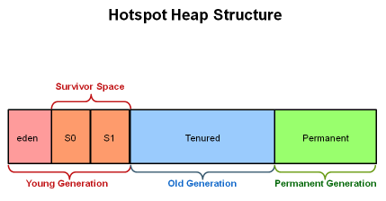

JVM의 메모리 구조를 학습하고 정리한다.

### JVM의 구조

JVM의 구조는 위의 그림과 같다. 각각의 영역의 역할들에 대해서 살펴본다

#### Class Loader
클래프 파일을 Runtime Data Area로 로드하는 역할을 한다. 모든 클래스 파일을 한 번에 올리는게 아니라 동적으로 필요할 때마다 올리며,클래스 로더는 로딩(클래스 읽기) -> 링킹(레퍼런스 연결) -> 초기화 단계로 동작한다.

##### 로딩
클래스 읽는 과정을 로딩이라고 하며 이 과정에서는 클래스로더가 먼저 .class 파일을 읽고 내용에 맞는 binary 데이터를 생성한뒤 JVM의 Method 영역에 저장한다. 이에 해당하는 내용들은 
- FQCN(Fully Qualified Class Name). 클래스가 속한 패키지명을 모두 포함한 이름
- 클래스, 인터페이스, Enum
- 각 클래스/인터페이스의 메소드, 변수
이 해당된다. 로딩이 끝나면 해당 클래스 타입의 class 객체를 생성해서 Heap 영역에 저장한다. (ex) Class&lt;class타입&gt;)

##### 링킹
레퍼런스를 연결하는 과정이다. 크게 세 단계로 나뉘는데, 첫번째로 Verify단계에선 .class파일이 유효한지 확인하고, 바이트코드가 조작된 경우 JVM 에러를 발생시킨다. 다음으로 Prepare과정은 메모리 준비 과정으로 클래스의 static 변수, 기본값에 필요한 메모리를 준비한다. 마지막으로 Resolve는 Symbolic Memory Reference를 실제 Reference로 교체하는 과정이라고 한다. Book book = new Book(); 이라는 코드를 작성했을때 book이라는 참조변수가 실제 Heap에 저장된 객체를 가리킬수 있도록 하는게 Resolve 과정이라고 한다.

##### 초기화
초기화 단계는 static으로 선언된 변수와 메소드에 메모리를 할당해서 초기값을 채우는 과정이라고 한다.

##### 클래스 로더의 구조
클래스 로더는 크게 3가지로 나뉜다. 위의 그림에서 확인할 수 있듯이 Bootstrap 클래스 로더, Extension 클래스 로더, Application 클래스 로더 이렇게 3가지가 있는데 Application 클래스 로더는 System 클래스 로더라고도 불린다. 
Bootstrap 클래스 로더는 $JAVA_HOME/jre/lib에 있는 JDK의 핵심 라이브러리 들을 로드하는 역할로 모든 클래스 로더객체들의 부모 역할을 한다.
Extension 클래스 로더는 Bootstrap 클래스 로더의 자식으로써 표준 핵심 자바 클래스의 확장을 로딩한다. $JAVA_HOME/jre/lib/ext/*.jar에 해당하는 클래스들을 로딩한다.
위의 두가지 클래스 로더는 JAVA에 속해있는 클래스들을 로드하는 역할을 하고, Application 클래스 로더는 어플리케이션 레벨의 클래스들을 로드하는 역할을 한다. 즉 개발자가 생성해서 classpath에 있는 컴파일된 클래스 파일들을 읽는 역할을 한다.

#### JVM MEMORY
해당 영역은 런타임에 데이터를 적재하는 영역으로 Runtime Data AREA라고 한다. 해당 영역에는 크게 5가지 영역이 있다.

##### Method Area
위에서 잠시 언급했듯이 클래스 로더가 클래스 파일을 읽어서 바이너리 데이터를 생성한 뒤 저장하는 영역이다. 저장하는 정보로는 클래스 변수의 타입, 이름, 접근제어자와 메소드의 리턴 타입, 이름, 파라미터, 접근 제어자 정보, 인터페이스인지 클래스인지 타입의 정보, 상수 정보, static 변수, final 클래스 변수 등이 저장되는 영역이다.

##### Heap Area
new 키워드로 생성된 객체와 배열이 생성되는 영역이다. 메소드 영역에 로드된 클래스만 생성이 가능하며, Garbage Collector가 참조되지 않는 메모리를 확인하고 제거하는 영역이다. Garbage Collector의 동작 원리는 이후 내용에서 다시 다룬다.

##### Stack Area
지역 변수, 파라미터, 리턴 값, 연산에 사용되는 임시 값등이 저장되는 영역이다. Book book = new Book();이라는 선언을 했을 경우 book은 스택영역에 생성되며 new Book()은 힙 영역에 생성된다. book은 new Book()이 저장된 힙 영역의 주소를 가지고 있다. Stack의 경우 메소드를 호출할 때마다 개별적으로 생성된다.

##### PC Register
쓰레드가 생성될때마다 생성되는 영역으로 Program Counter, 즉 현재 쓰레드가 실행되는 부분의 주소와 명령을 저장하고 있는 영역이다.

##### Native Method Stack
자바 외 언어로 작성된 네이티브 코드를 위한 메모리 영역이다. 보통 c/c++ 등의 코드를 수행하기 위한 스택이다. (JNI)

정리해보자면 Method와 Heap 영역은 모든 쓰레드가 공유하며, 나머지는 쓰레드별로 생성되며 공유하지 않는다.

##### JAVA 8 부터의 변화
위에서 언급했던 Method Area는 사실 Permenant Generation이라는 영역의 서브셋이다. 해당 영역은 메인 메모리의 HEAP으로부터 분리된 클래스 메타데이터 정보를 저장하기 위한 특별한 HEAP이라고 한다. 하지만 이는 JVM의 HEAP의 영역이다 보니 고질적인 문제인 OutOfMemoryError를 발생시켰다고 한다. Garbage Collector가 동작을 제대로 하지 않아서 메모리 누수가 발생하고 이로인해 발생했기 때문에 이 Heap의 영역에 할당된 구조를 개선하여 JAVA 8부터 새로운 영역으로 할당하는 것을 Oracle이 발표했다고 한다.

이 영역을 대체하는 것이 Metaspace라는 개념이다. 이 영역은 JVM에서 메모리를 할당하는 것이 아니라 순수 네이티브 메모리 영역으로부터 자동으로 증가하는 개념이다. 다만 기존 Permenant Generation 영역에서 static 정보들은 Heap으로 옮겨져서 GC의 영향을 받을 수 있게 한다고 한다. 이렇게 변한 이유는 메타 정보를 JVM에서 관리해서 개발자가 신경쓰는 것이 아닌, OS가 관리하는 영역으로 옮겨서 에러를 줄이자라는 의도로 보인다.

JAVA 8 이전의 구조

JAVA 8부터의 구조

#### Execution Engine
로드된 바이트 코드를 실행하는 파트이다. 명령어를 하나씩 실행하는 인터프리터 방식과 JIT(Just In Time) 컴파일러를 이용하는 방식이 있다. JIT 컴파일러는 적절한 시간에 전체 바이크 코드를 네이티브 코드로 변경해서 Execution Engine이 네이티브로 컴파일된 코드를 실행하는 것으로 성능을 높이는 방식이다.

#### Garbage Collector
Heap 메모리 영역에 생성된 객체들 중에 참조되지 않는 객체들을 탐색 후 제거하는 역할을 한다.

위의 그림은 힙의 구체적인 영역이다. 각 영역에 대해 잠시 살펴보면
- Young Generation : 최초로 객체가 생성되었을 경우 할당하는 공간. Minor GC가 발생하면 unreachable object는 삭제되고, 참조되는 객체들은 Old Generation으로 옮겨짐
- Old Generation : 오래 살아남은 객체들이 머무는 공간. 이 공간이 꽉차게 되면 Major GC가 발생

여기서 Minor GC란 Young Generation에서 발생하는 GC이고 Major GC는 Old영역에서 발생하는 GC이다. FULL GC는 전체 HEAP에서 발생하는 GC이며, Minor GC가 일어날 경우 Stop the World 이벤트라고 해서 모든 애플리케이션의 스레드가 중지된다.

참고
- https://coding-nyan.tistory.com/87
- https://inspirit941.tistory.com/296
- https://jithub.tistory.com/40
- https://www.baeldung.com/java-permgen-metaspace
- https://johngrib.github.io/wiki/java8-why-permgen-removed/
- https://blog.voidmainvoid.net/190