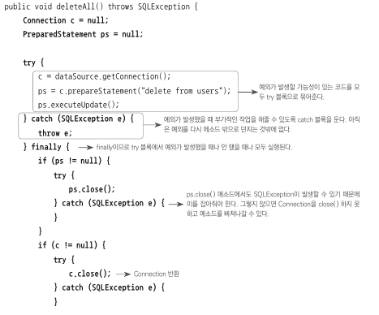
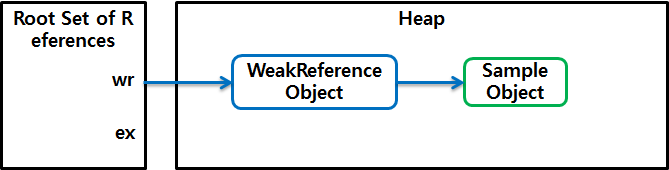
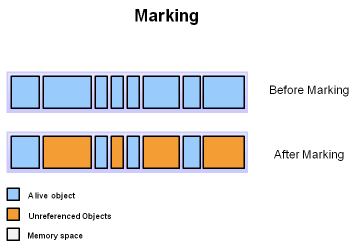
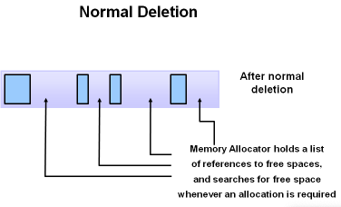
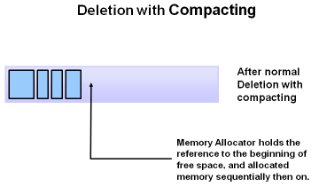
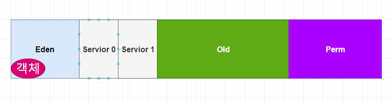
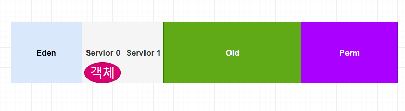
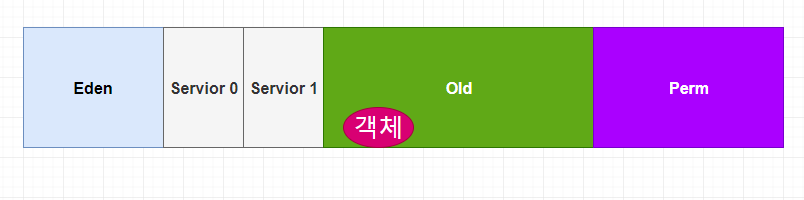
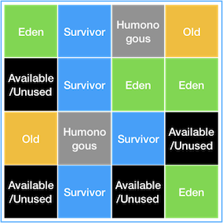
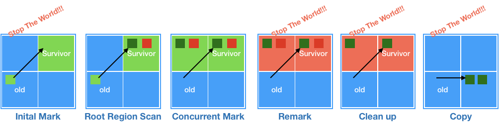

토비의 스프링에서 템플릿 섹션을 읽고 요약해본다. 

### 템플릿
개방 폐쇄의 원칙에 따라 코드를 보면, 어떤 부분은 고정되어있고 어떤 부분은 변경을 통해 확장을 하려하는 성질로 분류할 수 있다. 이런 관점으로 코드를 분류하여 변경되지 않은 부분을 변경하는 부분에서부터 분리하여 효과적으로 활용하는 방법을 템플릿이라고 이 섹션에선 정리하고 있다.

#### 예시


위 그림의 예시는 JDBC의 커넥션을 연결하고 실행하는 코드이다. 커넥션을 받고 쿼리 수행작업을 실행해야 하기 때문에 쿼리 수행을 하고난 이후 무조건 커넥션을 반납해야한다.

따라서 예외가 발생하든, 발생하지 않든 finally 부분에서 


HEAP에 생성한 객체를 참조하기 위해선 맨 처음에 참조하는 곳이 있어야 한다. 이 객체 참조를 root set이라고 한다. 


위의 그림은 프로그램이 실행중에 할당된 메모리 구조를 예시로 들어본 것으로 객체 참조는 크게 4가지의 종류를 확인할 수 있다.

1. 스택에서의 힙 객체 참조
2. 힙 내에서의 다른 객체 참조
3. JNI에 의해 생성된 객체 참조
4. 메서드 영역의 정적변수에 의한 참조

이중 2번을 제외한 나머지로 reachability를 판단할 수 있게 된다.


root set을 통해 참조할 수 있는 객체와 할수 없는 객체를 그려보면 위와 같다. 위의 객체 참조는 java.lang.ref 패키지를 참조하지 않는 일반 참조로 strong reference라고 부른다고 한다.

#### Soft, Weak, Phantom Reference
일반적인 참조인 strong reference말고 3가지의 참조 방식을 ref 패키지에서 제공한다고 한다. 예를 들어 WeakReference 클래스는 객체를 캡슐화한 WeakReference 객체를 생성하고 이는 JAVA GC가 특별하게 다룬다고 한다.

```
WeakReference<Sample> wr = new WeakReference<Sample>( new Sample());  
Sample ex = wr.get();  
...
ex = null;  
```

예를 들어 위와 같이 객체를 생성한다고 하면

위와 같은 참조 형태를 띄게 할 수 있다. 즉 직접 접근하는 strong reference와는 다른 형태이며 java 스팩에선 strong reference가 아닌 다른 객체 참조를 위해 만든 객체를 reference object라고 부르며 이 객체가 참조하는 객체를 referent 라고 부른다고 한다. 위의 예시로 들면 new WeakReference()로 만들어진 객체가 reference object이고 new Sample() 객체가 referent라고 할 수 있다. 

이런 방식들로 객체를 생성하는 방법이 있으며 이런 방식들까지 포함한 reachability 는 총 5가지가 있다고 한다

- strongly reachable: root set으로부터 시작해서 어떤 reference object도 중간에 끼지 않은 상태로 참조 가능한 객체, 다시 말해, 객체까지 도달하는 여러 참조 사슬 중 reference object가 없는 사슬이 하나라도 있는 객체

- softly reachable: strongly reachable 객체가 아닌 객체 중에서 weak reference, phantom reference 없이 soft reference만 통과하는 참조 사슬이 하나라도 있는 객체

- weakly reachable: strongly reachable 객체도 softly reachable 객체도 아닌 객체 중에서, phantom reference 없이 weak reference만 통과하는 참조 사슬이 하나라도 있는 객체

- phantomly reachable: strongly reachable 객체, softly reachable 객체, weakly reachable 객체 모두 해당되지 않는 객체. 이 객체는 파이널라이즈(finalize)되었지만 아직 메모리가 회수되지 않은 상태이다.

- unreachable: root set으로부터 시작되는 참조 사슬로 참조되지 않는 객체

##### Weak Reference
위에서 잠시 예시로 언급됐던 방식으로 WeakReference클래스에 의해 생성되는 객체 참조 방식이다. 이 방식으로 생성되는 객체는 GC를 수행할 때마다 회수의 대상이 된다. WeakReference 객체로만 참조되고 있다면 해당 객체를 null로 만들고 이를 GC가 회수한다. LRU 캐시 구현할 때 사용되는 방법이라고 한다.

##### Soft Reference
SoftReference객체로만 참조되는 객체 참조 방식이다. 이 방식으로 생성되는 객체는 힙의 메모리 여유 공간과 해당 객체의 사용빈도수에 따라 GC 여부가 결정된다고 한다. 오라클에선 -XX:SoftRefLRUPolicyMSPerMB=<N> 이라는 JVM 옵션을 통해 조절할 수 있다고 한다.

##### Reference Queue
ref 패키지에서 제공하는 이 객체는 Soft Reference나 Weak Reference 방식으로 생성된 객체가 GC 대상이 되면 사용하는 QUEUE이다. GC 대상이 된 객체는 NULL이 되고 WeakReference나 SoftReference 객체는 ReferenceQueue에 enque 되며 이 작업은 gc에 의해 이뤄진다. ReferenceQueue의 poll이나 remove메서드를 통해 softly reference나 weak reference로 생성된 객체가 gc 되었는지를 파악할 수 있고 이 객체들이 사용했던 리소스나 객체 자체에 대한 후처리 작업을 진행할 수 있다. 이 Reference Queue를 인자로 받는 생성자를 PhantomReference는 반드시 사용한다. 이 PhantomReference 클래스는 Queue를 인자로 받아, gc 대상이 되면 본인이 생성한 객체를 null로 만들지 않고 phantomly reachable 객체로 만든 후에 큐에 enqueue한 다음, 객체의 파이널라이즈 이후에 필요작업을 처리한다고 한다.

##### Phantomly Reference
위에서 잠시 언급했던 대로 다른 reference 방식과는 좀 다르다. GC가 처리하는 방식은 
1. soft references
2. weak references
3. 파이널라이즈
4. phantom references
5. 메모리 회수
순서로, GC가 탐색하는 대상이 위의 두가지가 아닐경우, 먼저 객체를 FINALIZE를 한후 메모리 회수를 한다. 좀 특이한 개념이며 FINALIZE 자체가 효율이 떨어져서 사용하면 안되는 방식이기 때문에 굳이 알아둘 필요는 없을 것 같다.(참고 : https://brunch.co.kr/@oemilk/122)

### GC의 일반적인 방식
GC의 일반적인 방식은 크게 2가지 순서이다
- Marking


우선 첫번째로 unreachable한 객체들을 판별해낸다. 방식은 위에서 언급했던 reference들을 판별해내는 방식이다.

- Normal Deletion


두 번째로 Unreachable한 객체들을 제거한다.

- Deletion And Compacting
 

그냥 삭제 하는 경우도 있지만, gc의 종류에 따라서 삭제하고 공간을 다시 압축하는 경우도 있다고 한다.

위처럼 marking 하고 삭제하는 방법을 mark and sweep 이라고 한다.

힙 영역을 대상으로 순서를 분석하자면
1. 객체가 Eden 영역에 올라간다
 
2. Eden 영역이 꽉차면 survivor 영역으로 내려간다. 단 survivor 영역 두개중 하나는 반드시 비어있어야 한다. 만약 eden에서 survivor로 내려가지 않고 직접 old로 내려갈 경우는 eden에서 내려오는 객체의 사이즈가 survivor의 영역보다 클 경우이다. 만약 survivor 영역이 가득 차게 되면 minor gc가 한번 일어나고, 여기서 살아남은 것들을 다른 survivor영역으로 옮긴다.  
 
3. 이중에서 오래 남은 객체는 old 영역으로 이동한다.
 

### GC의 종류
GC의 종류에는 여러가지가 있다. 이를 살펴본다.

#### Serial GC
일반적인 방식에서 언급했던 그대로 수행한다. mark하고 heap 영역의 앞부터 확인하여 sweep하고 compact하는 방식이다.

#### Parallel GC
기본적으로 일반 serial gc와 같은 방식이나 여러개의 쓰레드를 사용하여 처리하는 방식이다.
 

#### Parallel Old GC
Parallel GC를 개선한 버전이다. Old gc 부분이 개선되었다고 한다. Parallel GC의 경우는 Young GENERATION 영역에서만 Parallel 하게 수행하는데 이 GC는 OLD 영역에서도 수행한다고 한다.

#### CMS GC
이전 gc보다 stop the world를 최소화하는데 초점을 맞춘 gc 방식이라고 한다.
Initial Mark -> Concurrent Mark -> Remark -> Concurrent Sweep 방식으로 진행한다고 한다.

- Initial Mark
GC 과정에서 살아남은 객체를 탐색하는 시작 객체(GC Root)에서 참조 Tree상 가까운 객체만 1차적으로 찾아가며 객체가 GC 대상(참조가 끊긴 객체)인지를 판단한다. 이 때는 STW 현상이 발생하게되지만, 탐색 깊이가 얕기 때문에 STW 발생 기간이 매우 짧다.

- Concurrent Mark
STW 현상없이 진행되며, Initial Mark 단계에서 GC 대상으로 판별된 객체들이 참조하는 다른 객체들을 따라가며 GC 대상인지를 추가적으로 확인한다.

- Remark
Concurrent Mark 단계의 결과를 검증한다. Concurrent Mark 단계에서 GC 대상으로 추가 확인되거나 참조가 제거되었는지 등등의 확인을 한다. 이 검증과정은 STW 를 유발하기 때문에 STW 지속시간을 최대한 줄이기 위해 멀티스레드로 검증 작업을 수행한다.

- Concurrent Sweep
STW 없이 Remark 단계에서 검증 완료된 GC 객체들을 메모리에서 제거한다.

해당 gc는 compaction을 필요할 때만 수행한다고 한다.

#### G1 GC
위에서 언급한 방법들은 큰 메모리에서 좋은 성능을 내지 못했기 때문에 만들어진 gc라고 한다.
 

위에서 확인할 수 있듯이 Eden, Survivor, Old 영역이 존재하긴 하지만 고정된 크기로 고정된 위치에 있는 것이 아니며 힙 영역을 Region이라는 특정한 크기로 나눠서 각 상태에 따러 역할(Eden, Survivor, Old)을 부여한다고 한다.

G1 GC에서는 그동안 봐왔던 Heap 영역에서 보지 못한 Humongous, Available/Unused 이 존재하며 두 Region에 대한 역할은 아래와 같다.

- Humongous : Region 크기의 50%를 초과하는 큰 객체를 저장하기 위한 공간이며, 이 Region 에서는 GC 동작이 최적으로 동작하지 않는다.

- Available/Unused : 아직 사용되지 않은 Region을 의미한다.

G1 GC에서 Young GC 를 수행할 때는 STW(Stop-The-World) 현상이 발생하며, STW 시간을 최대한 줄이기 위해 멀티스레드로 GC를 수행한다. Young GC는 각 Region 중 GC대상 객체가 가장 많은 Region(Eden 또는 Survivor 역할) 에서 수행 되며, 이 Region 에서 살아남은 객체를 다른 Region(Survivor 역할) 으로 옮긴 후, 비워진 Region을 사용가능한 Region으로 돌리는 형태로 동작한다.

G1 GC에서 Full GC 가 수행될 때는 Initial Mark -> Root Region Scan -> Concurrent Mark -> Remark -> Cleanup -> Copy 단계를 거치게된다.

- Initial Mark
Old Region 에 존재하는 객체들이 참조하는 Survivor Region 을 찾는다. 이 과정에서는 STW 현상이 발생하게 된다.

- Root Region Scan
Initial Mark 에서 찾은 Survivor Region에 대한 GC 대상 객체 스캔 작업을 진행한다.

- Concurrent Mark
전체 힙의 Region에 대해 스캔 작업을 진행하며, GC 대상 객체가 발견되지 않은 Region 은 이후 단계를 처리하는데 제외되도록 한다.

- Remark
애플리케이션을 멈추고(STW) 최종적으로 GC 대상에서 제외될 객체(살아남을 객체)를 식별해낸다.

- Cleanup
애플리케이션을 멈추고(STW) 살아있는 객체가 가장 적은 Region 에 대한 미사용 객체 제거 수행한다. 이후 STW를 끝내고, 앞선 GC 과정에서 완전히 비워진 Region 을 Freelist에 추가하여 재사용될 수 있게 한다.

- Copy
GC 대상 Region이었지만 Cleanup 과정에서 완전히 비워지지 않은 Region의 살아남은 객체들을 새로운(Available/Unused) Region 에 복사하여 Compaction 작업을 수행한다.

 

참고
- https://d2.naver.com/helloworld/329631
- https://brunch.co.kr/@oemilk/122
- https://blog.voidmainvoid.net/190
- https://deveric.tistory.com/64
- https://d2.naver.com/helloworld/1329
- https://mirinae312.github.io/develop/2018/06/04/jvm_gc.html