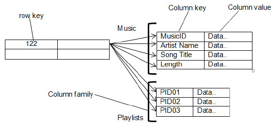
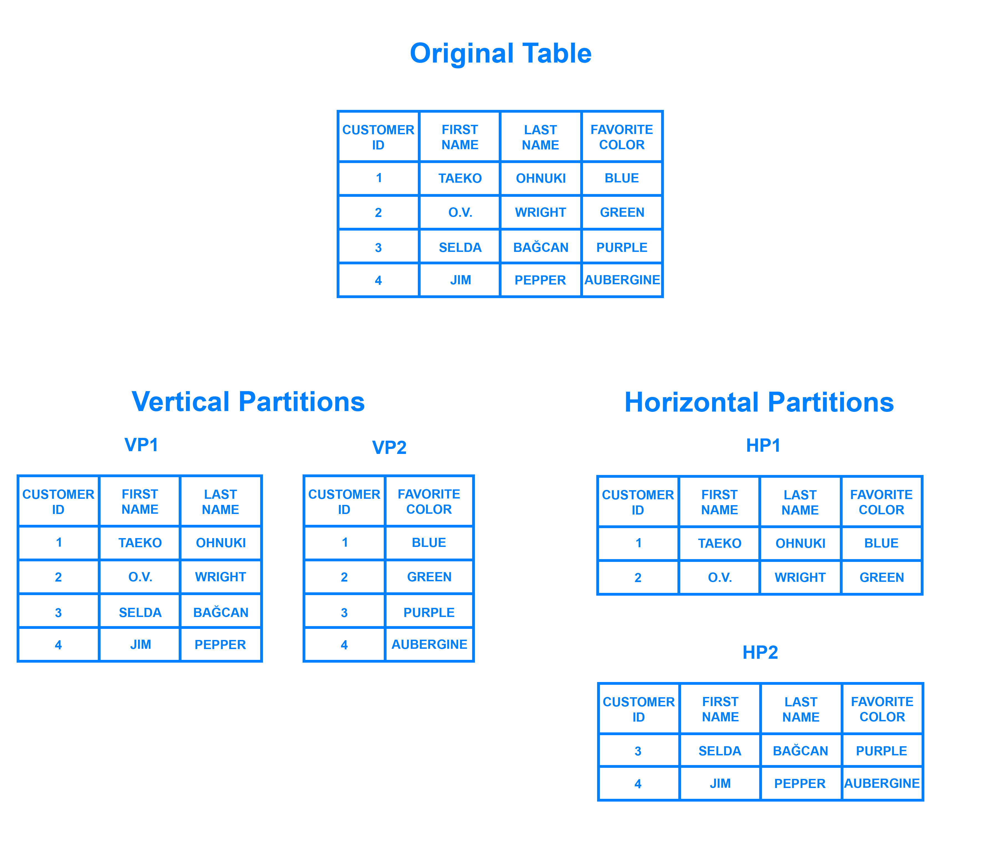
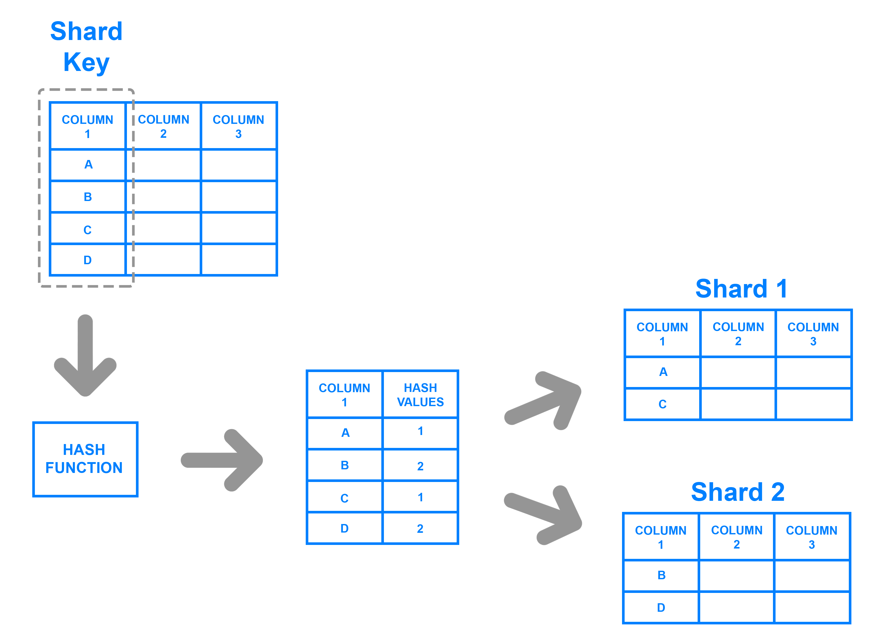
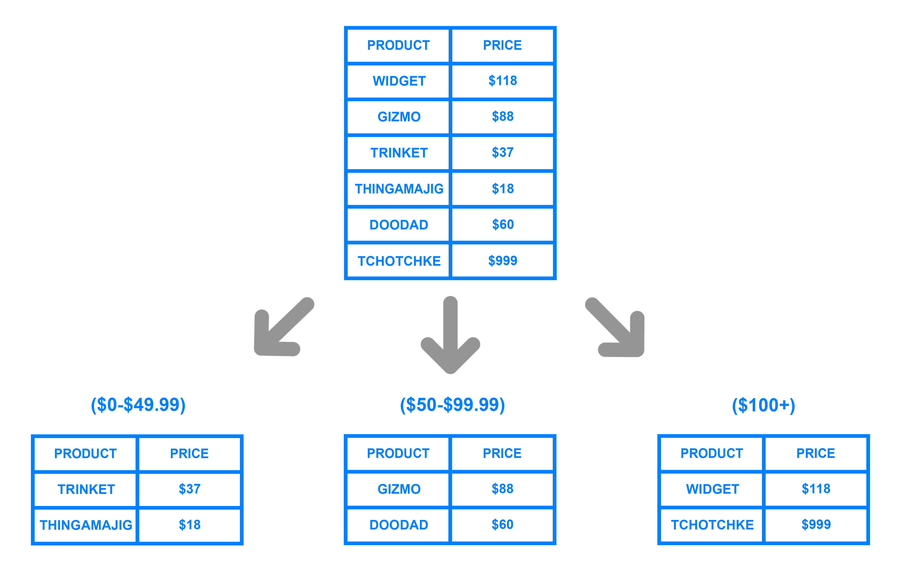
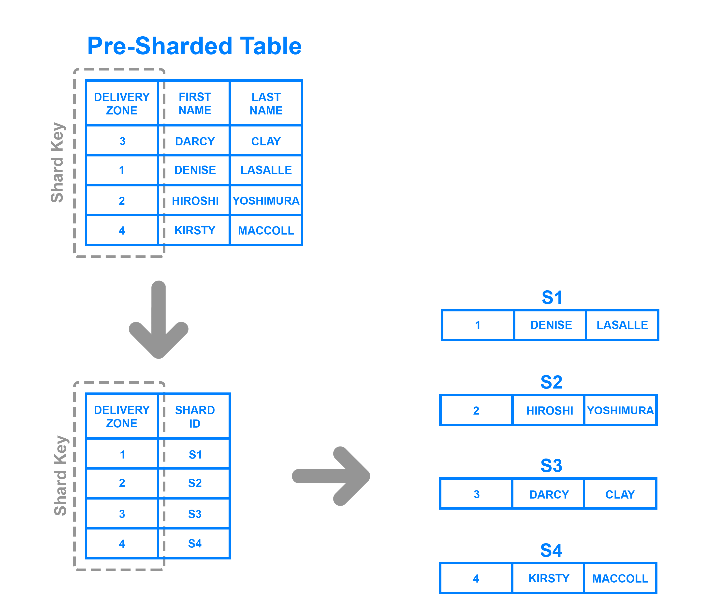

DB에서 NOSQL과 SQL의 차이점, 그리고 인덱스에 대해서 알아본다

### NOSQL VS SQL
SQL은 단어 그대로의 의미를 보자면 Structured Query Language로, 관계형 DB(RDBMS)의 데이터를 관리하기 위해 설계된 언어이다. 즉 이 포스팅에서 SQL을 본다는 것은 RDBMS의 특징을 본다고 생각하면 된다.

RDBMS에서는 정해진 데이터 스키마를 따라서 테이블에 데이터를 저장할 수 있고, 관계를 통해 여러 테이블에 데이터가 분산 된다.

NOSQL은 여러가지 의미가 있다. NO SQL이라고 해석할 수 도 있는데 대부분은 NOT ONLY SQL로 보는 추세라고 한다. 즉 RDBMS의 특성과 함께 다른 특성들을 부가적으로 지원한다는 의미이다.

NOSQL의 특징을 확인해보자면

- 관계형 모델을 사용하지 않으며 테이블간의 조인 기능 없음
- 직접 프로그래밍을 하는 등의 비SQL 인터페이스를 통한 데이터 액세스
- 대부분 여러 대의 데이터베이스 서버를 묶어서(클러스터링) 하나의 데이터베이스를 구성
- 관계형 데이터베이스에서는 지원하는 Data처리 완결성(Transaction ACID 지원) 미보장
- 데이터의 스키마와 속성들을 다양하게 수용 및 동적 정의 (Schema-less)
- 데이터베이스의 중단 없는 서비스와 자동 복구 기능지원
- 다수가 Open Source로 제공
- 확장성, 가용성, 높은 성능

등이 있다.

NOSQL DB의 종류로는 다음과 같다.

- Key Value DB : Key와 Value의 쌍으로 데이터가 저장되는 가장 단순한 형태의 솔루션으로 Amazon의 Dynamo Paper에서 유래. Riak, Vodemort, Tokyo 등의 제품이 많이 알려져 있음.
- Wide Columnar Store : Big Table DB라고도 하며, Google의 BigTable Paper에서 유래. Key Value 에서 발전된 형태의 Column Family 데이터 모델을 사용하고 있고, HBase, Cassandra, ScyllaDB 등이 이에 해당.
- Document DB : Lotus Notes에서 유래되었으며, JSON, XML과 같은 Collection 데이터 모델 구조를 채택. MongoDB, CoughDB가 이 종류에 해당.
- Graph DB : Euler & Graph Theory에서 유래한 DB입니다. Nodes, Relationship, Key-Value 데이터 모델을 채용. Neo4J, OreientDB 등의 제품 존재.

* 여기서 coloumn family 란 key value 모델을 확장한 모양새로, 하나의 row에 하나 이상의 컬럼이 있어야하며 이 컬럼이 다시 여러개의 key value map으로 구성되는 구조를 의미한다.

#### 장단점 및 선택해야할 경우

RDMS의 장점으로는 명확하게 정의 된 스키마, 데이터 무결성 보장한다. 또한 관계를 통해 각 데이터를 중복없이 한 번만 저장할 수 있다.
 

NoSQL의 장점으로는 스키마가 없기때문에, 유연성이 높다. 즉, 저장된 데이터를 언제든지 조정하고 새로운 "필드"를 추가할 수 있습니다. 또한 데이터는 애플리케이션에 필요한 형식으로 저장됩니다. 이렇게 하면 데이터를 가져오는 속도가 빨라진다. 수직 및 수평 확장이 가능하므로 데이터베이스가 애플리케이션에서 발생시키는 모든 읽기 / 쓰기 요청을 처리 할 수 있다.
 

RDBMS의 단점으로는 상대적으로 덜 유연하며, 데이터 스키마는 미리 알고 계획해야하며 수정할 시 여러가지 고려해야할 사항이 많다. 또한 관계를 맺고 있기 때문에 필요한 데이터 추출을 위해 JOIN문이 많은 매우 복잡한 쿼리가 만들어 질 수 있다. 수평 확장이 어렵고, 보통 수직 확장만 가능하다. 즉 어느 시점에서 처리량/처리 능력과 관련하여 약간의 성장 한계에 직면하게 될 수 있다.

NoSQL의 단점으로는 유연성 때문에, 데이터 구조 결정을 늦어질 수 있으며
복사된 데이터가 변경되면 여러 콜렉션과 문서를 수정해야 한다.
 
RDMS를 선택할 경우는 앱의 여러 부분에서 관련 데이터가 비교적 자주 변경되는 경우이며 명확한 스키마가 중요하며, 데이터구조가 극적으로 변경되지 않을 때 사용하면 좋다.

NoSQL은 정확한 데이터 요구사항을 알 수 없거나 관계를 맺고 있는 데이터가 자주 변경(수정)되는 경우, 읽기(read)처리를 자주하지만, 데이터를 자주 변경하지 않는 경우, 데이터베이스를 수평으로 확장해야 하는 경우 등이 이에 해당한다.

#### 수직 확장 & 수평 확장
수직 확장은 스케일 업이라고 하며 수평 확장은 스케일 아웃이라고 한다. 스케일 업은 CPU나 RAM 등을 추가하여 고성능의 부품 서버로 교환하는 방법이며, 스케일 아웃은 서버를 여러대로 늘려서 부하를 균등하게 해주는 로드밸런싱을 추가하고 서비스를 제공하는 형태이다.

DB에서 사용하는 스케일 아웃 기술이 샤딩이다. 샤딩에도 수평 샤딩과 수직 샤딩이 있는데 한테이블의 ROW들을 다른 테이블로 분리하는 개념을 수평 샤딩이라고 하며, 테이블 자체를 분리 하는 개념을 수직 샤딩이라고 한다.

수평적 확장인 샤딩의 장단점을 살펴보면 장점으로는
- 머신을 추가하는 스케일 아웃이 가능
- 각 테이블의 행이 줄었기 때문에 쿼리 속도 빠르게
- DB 하나가 마비가 되었어도 나머지 DB에 데이터가 남아있기 때문에 일부는 동작하기 어렵지만 나머지는 동작 가능

등이 있다. 단점으로는
- 데이터 손상, 유실등의 가능성이 크다
- 데이터가 한쪽으로 쏠리면 샤딩이 무의미 하다
- 쪼개면 다시 합치기 어렵다
- 모든 데이터베이스의 자체 기능이 아니다. 본인이 직접 구현해야된다.
등이 있다.

샤딩 구현방법은 몇가지가 있는데 이를 살펴본다.

##### Key Based Sharding

위의 그림과 같이 컬럼하나의 값을 해시함수를 통해서 해시키를 추출하고, 이를 통해 데이터를 나누는 방법이다. 해시 함수를 사용해서 데이터를 넣기 때문에, 만약 데이터베이스를 하나 더 추가해서 나눠서 들어갈경우, 기존에 맞춰서 해시값 추출하던 로직을 전부 삭제하고 다시 배치를 해야하기 때문에 이러한 단점이 존재한다.

장점으로는 데이터를 골고루 분배 가능하며, 모든 데이터가 어디에 위치하는지 알아야 하는 map을 지닐 필요가 없다.

##### Range Based Sharding

컬럼의 값의 범위를 기반으로 데이터를 나누는 방법이다. 장점으로는 application code가 값의 범위를 알고있으면 해당하는 shard를 알 수 있기 때문에 거기에 쓰고 읽기가 가능하다. 단점으로는 특정 shard에 데이터가 몰리는 부분을 막을 수 없다.

##### Directory Based Sharding

hash 함수를 거치지 않고, 해당 shard key 가 어떤 곳에 쓰여야하는지 look uptable에 저장되어, 쓰고 넣을 때 lookup table에서 키를 보고 shard를 참조하는 구조이다. 단점으로는 lookup table이 손상되거나 하면 장애가 발생 가능하며, lookup table이 중간에 생기기 때문에 성능의 저하가 올 수 있다.

샤딩을 하지 않고 성능을 올릴 수 있는 방법도 몇가지 있는데, 먼저 캐싱이 있다. 요청된 데이터들을 캐시에 저장해놓고, 다음 요청시에 캐시를 먼저 확인해 본 후 있으면 그대로 반환하고, 없으면 DB에 접근해서 동작하는 기능이다.

또 한가지는 read 작업을 할 수 있는 secondary server를 만드는 것이다. 따라서 쓰기는 쓰기용 server에 동작을 하고 읽기작업은 secondary server에서 동작을 하는 것이다. 이는 쓰기와 읽기 작업을 나눔으로써 한 머신에 로드를 분산시키기 위함이다.

#### ACID
ACID는 DB의 특성을 의미하는 것으로 Atomicity, Consistency,Isolation, Durability를 뜻한다.

- 원자성(Atomicity) :  트랜잭션과 관련된 작업들이 부분적으로 실행되다가 중단되지 않는 것을 보장하는 능력이다. 예를 들어, 자금 이체는 성공할 수도 실패할 수도 있지만 보내는 쪽에서 돈을 빼 오는 작업만 성공하고 받는 쪽에 돈을 넣는 작업을 실패해서는 안된다. 원자성은 이와 같이 중간 단계까지 실행되고 실패하는 일이 없도록 하는 것이다.

- 일관성(Consistency) : 트랜잭션이 실행을 성공적으로 완료하면 언제나 일관성 있는 데이터베이스 상태로 유지하는 것을 의미한다. 무결성 제약이 모든 계좌는 잔고가 있어야 한다면 이를 위반하는 트랜잭션은 중단된다.

- 독립성(Isolation) : 트랜잭션을 수행 시 다른 트랜잭션의 연산 작업이 끼어들지 못하도록 보장하는 것을 의미한다. 이것은 트랜잭션 밖에 있는 어떤 연산도 중간 단계의 데이터를 볼 수 없음을 의미한다. 은행 관리자는 이체 작업을 하는 도중에 쿼리를 실행하더라도 특정 계좌간 이체하는 양 쪽을 볼 수 없다. 공식적으로 고립성은 트랜잭션 실행내역은 연속적이어야 함을 의미한다. 성능관련 이유로 인해 이 특성은 가장 유연성 있는 제약 조건이다.

- 지속성(Durability) : 성공적으로 수행된 트랜잭션은 영원히 반영되어야 함을 의미한다. 시스템 문제, DB 일관성 체크 등을 하더라도 유지되어야 함을 의미한다. 전형적으로 모든 트랜잭션은 로그로 남고 시스템 장애 발생 전 상태로 되돌릴 수 있다. 트랜잭션은 로그에 모든 것이 저장된 후에만 commit 상태로 간주될 수 있다.

### 인덱스
DB에서 인덱스란 추가적인 쓰기 작업과 저장 공간을 활용하여 검색 속도를 향상시키기 위한 자료구조이다. 책갈피랑 같은 개념이라고 보면된다. 인덱스를 활용하면 SELECT 외에도 UPDATE와 DELETE도 성능이 향상되는데, 이는 해당 연산들을 사용할 때도 조회를 사용하기 때문이다. 다만 UPDATE와 DELETE의 경우 조회는 빨라지나, 연산 후에 데이터의 인덱스 사용하지 않게 하는 작업과, 수정한 데이터의 인덱스를 추가해야하기 때문에 이에 대한 추가 연산시간이 필요하다.

인덱스의 장단점은 아래와 같다.

- 장점
1. 테이블을 조회하는 속도와 그에 따른 성능을 향상시킬 수 있다.
2. 전반적인 시스템의 부하를 줄일 수 있다.

- 단점
1. 인덱스를 관리하기 위해 DB의 약 10%에 해당하는 저장공간이 필요하다.
2. 인덱스를 관리하기 위해 추가 작업이 필요하다.
3. 인덱스를 잘못 사용할 경우 오히려 성능이 저하되는 역효과가 발생할 수 있다.

UPDATE와 DELETE의 경우, 기존 인덱스를 삭제하는게 아니라 사용하지 않음 처리를 하기 때문에 해당 작업이 빈번할 경우 인덱스가 계속 늘어나는 현상이 발생하게 된다.

그리서 인덱스를 사용할 경우는 
1. 규모가 작지 않은 테이블
2. INSERT, UPDATE, DELETE가 자주 발생하지 않는 컬럼
3. JOIN이나 WHERE 또는 ORDER BY에 자주 사용되는 컬럼
4. 데이터의 중복도가 낮은 컬럼
정도에서 사용하면 좋을 것이다.

인덱스의 자료구조는 해시테이블과, B+트리가 존재하는데 해시테이블은 해시 연산을 통해 키를 만들고 조회하기 때문에 빠른 검색을 지원한다. 하지만 =만 지원하기 때문에 &lt; 나 &gt; 를 사용해야할 경우 적합하지 않다.

#### B+트리

인덱스는 위와 같은 B+트리의 구조를 지니고 있따. 리프노트, 즉 말단 노드에서만 인덱스와 함께 데이터를 가지고 있고 나머지 노드들은 데이터를 위한 인덱스만을 가지고 있으며, 리프노드들끼리 링크드리스트로 연결되어있다.

참고
- https://www.samsungsds.com/kr/insights/1232564_4627.html
- https://www.researchgate.net/figure/Column-Family-database_fig1_267035006
- https://devuna.tistory.com/25
- https://velog.io/@matisse/Database-sharding%EC%97%90-%EB%8C%80%ED%95%B4
- https://mangkyu.tistory.com/96
- https://ko.wikipedia.org/wiki/ACID