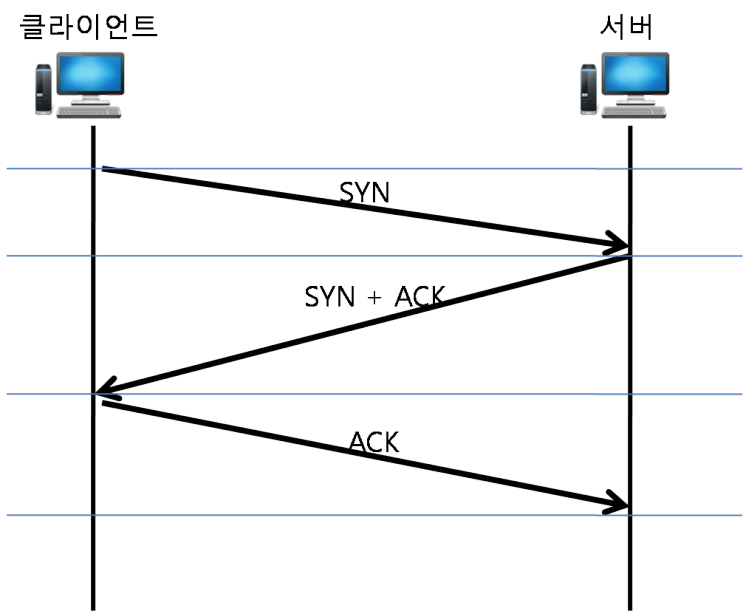
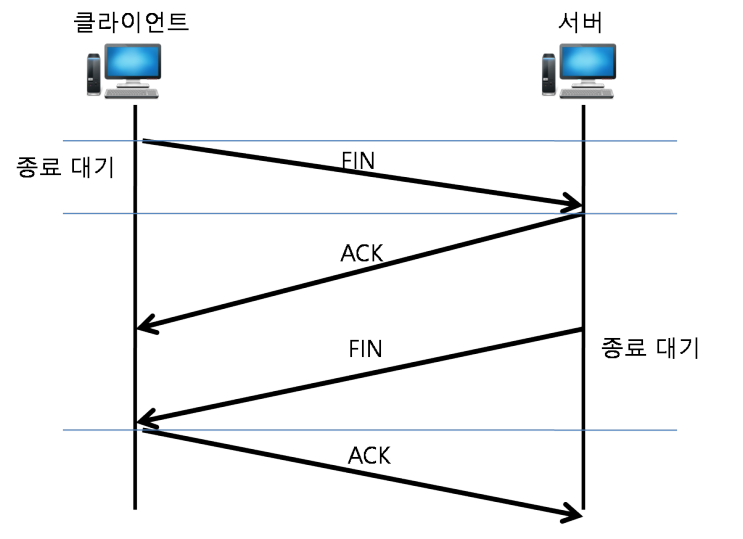
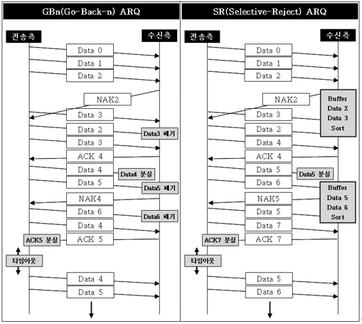
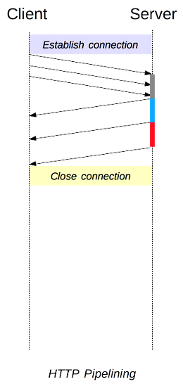
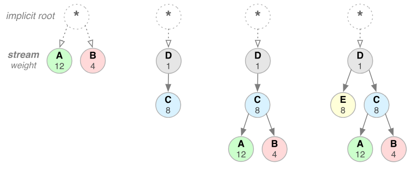
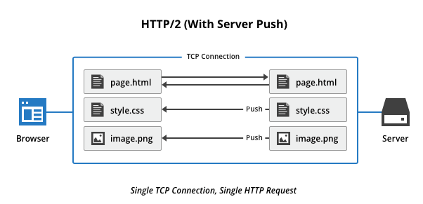
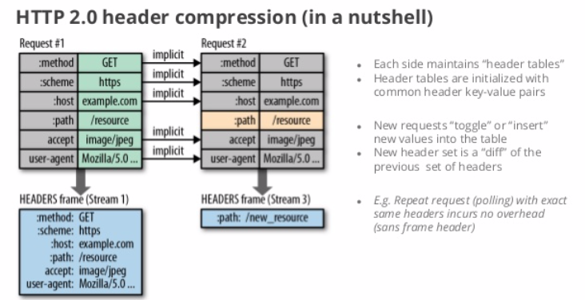

프로토콜과 ssl 인증 방식에 대해서 알아본다.

### 프로토콜
프로토콜은 전송 규약으로, 각 계층별로 프로토콜들이 존재한다. 따라서 각 계층별로 프로토콜을 알아볼건데, 이중에서 중요하다고 생각하다는 것들만 정리해본다

#### TCP
전송 계층의 프로토콜로 연결 지향형 프로토콜이다. 흐름 제어와 오류 제어 기능을 제공하여 높은 신뢰성, 연결과 해제, 데이터 체크섬, 데이터 흐름 제어 역할등을 수행한다.

위의 그림은 TCP가 연결을 맺는 3way handshaking이다. 먼저 연결을 맺고자 하는 클라이언트가 SYN을 보냈을 경우, SYN을 받은 서버가 SYN과 더불어 ACK를 보내서 클라이언트에 보낸다. 클라이언트는 이 메시지를 받아서 ACK를 다시 서버에 보내면 연결이 완료된다. 

위의 그림은 연결을 종료할때 동작하는 4way handshaking의 구조이다. 클라이언트가 끝낸다고 FIN을 보내면, 서버가 ACK를 클라이언트에게 보낸다. 그리고 FIN 을 다시 클라이언트에 보내면 클라이언트가 ACK를 서버에게 보낸다.

##### 흐름 제어
TCP 에서 제공하는 기법으로 송신측과 수신측의 데이터 처리 속도차이를 해결하기 위한 기법이다. 송신측이 수신측의 데이터처리속도보다 빠르게 데이터 전송을 하게 될 경우, 문제가 발생하게된다. 큐의 사이즈보다 더많은 데이터를 보내면 데이터 손실이 일어나기 때문에 강제적으로 데이터 전송을 줄이는 방법을 흐름 제어라고 한다.

방법은 아래와 같다.
1. STOP AND WAIT : 매번 전송패킷에 대해서 확인 응답을 받아야 다음 패킷을 전송한다.
2. 슬라이딩 윈도우 : 수신측에서 설정한 윈도우 크기만큼 데이터를 전송한다. 수신측의 여유 공간을 반영하여 송신측에서 조절해서 보내기 때문에 흐름제어가 가능하다.

##### 혼잡 제어
송신측의 데이터 전달과 네트워크 처리속도 차이를 해결하기 위한 기법이다. 네트워크상의 라우터에 데이터가 몰리게 되면 처리하는 양의 한계가 있기 때문에 데이터 손실이 일어날 수있다. 따라서 이럴 경우 데이터 전송을 강제로 줄이게 된다.

방법은 아래와 같다.
1. SLOW START : 윈도우 크기를 1에서부터 2배씩 늘리다가 혼잡이 발생하면 다시 1로 떨어뜨린다. 그 이후 혼잡 발생한 시점의 절반까지는 2배씩 늘리다가, 도달하게 되면 1씩 완만하게 늘린다.
2. Fast Recovery : 혼잡상태에 들어가면, slow start와는 다르게 현재 사이즈의 반으로 줄이고, 선형으로 증가시킨다.

##### 오류 제어
패킷 손실 되었을 경우 재전송을 통해 오류를 복구하는 방법이다. 

방법은 아래와 같다.
1. Stop and Wait ARQ : 송신 측에서 1개의 프레임을 송신하고, 수신측에서 수신된 프레임의 에러 유무에 따라 ACK 혹은 NAK(Negative Acknowledgement)를 보내는 방식이다.
식별을 위해 데이터 프레임과 ACK 프레임은 각각 0, 1 번호를 번갈아가며 부여한다. 수신측에 데이터를 받지 못했을 경우 NAK를 보내고, NAK를 받은 송신측은 데이터를 재전송한다.
만약, 데이터나 ACK가 분실되었을 경우 일정 간격의 시간을 두고 타임아웃이 되면 송신측은 데이터를 재전송한다.

2. Go-Back-n ARQ : 전송된 프레임이 손상되거나 분실된 경우 그리고 ACK 패킷의 손실로 인한 TIME_OUT이 발생한 경우, 확인된 마지막 프레임 이후로 모든 프레임을 재전송한다. 슬라이딩 윈도우는 연속적인 프레임 전송 기법으로 전송측은 전송된 프레임의 복사본을 가지고 있어야 하며, ACK와 NAK 모두 각각 구별해야 한다.
ACK : 다음 프레임을 전송
NAK : 손상된 프레임 자체 번호를 반환

3. SR(Selective-Reject) ARQ : GBn ARQ의 확인된 마지막 프레임 이후의 모든 프레임을 재전송하는 단점을 보완하는 기법이다. SR ARQ는 손상되거나 손실된 프레임만 재전송한다.
그렇기 때문에 별도의 데이터 재정렬을 수행해야 하며, 별도의 버퍼를 필요로 한다.
수신 측에 버퍼를 두어 받은 데이터의 정렬이 필요하다.

GO back n 과 SR의 동작은 아래 그림과 같다.

#### UDP
TCP와 마찬가지로 전송 계층의 프로토콜이다. TCP와는 다르게 비연결형 프로토콜이다. 데이터그램 방식으로 서비스를 제공하며, Checksum 필드 이외의 오류 검증 방식은 존재하지 않아 신뢰성이 없다. 대신 TCP 보단 속도가 빠르다. 신뢰성이 없기 때문에 데이터 손실이 일어나는 서비스에선 사용할 수 없으며, 연속성이 중요한 스트리밍 서비스 같은 곳에서 사용 가능하다.

#### HTTP
응용 계층의 프로토콜이다. 응용계층의 프로토콜은 FTP, SMTP 등등 다양하나 HTTP만큼 많이 사용하는 프로토콜이 없기 때문에 이를 중점적으로 확인해본다.

이 프로토콜은 서버 클라이언트 모델을 따르는 프로토콜로, TCP 프로토콜을 기반으로 동작한다. HTTP의 특징으로는 Connectless와 Stateless가 있다. 서버에 연결해서 요청해서 응답을 받으면 연결을 끊어버리는 방식이기 때문에 Connectless이며, 연결을 끊기 때문에 이전 데이터가 없어서 Stateless이다. 로그인 같은 경우를 처리하기 위해서 cookie를 이용하여 처리한다.

##### HTTP 1.1/2.0
다만 이렇게 매번 연결을 맺고 동작하고 끊고 하는 동작이 계속되다 보니, 비효율적이라서 이를 개선하기 위해 1.1이 나왔다. 기존의 connection을 재사용할 수 있게 할 수 있으며, 파이프라이닝을 추가하여 첫번째 요청이 응답오기 전에 요청들을 미리 보낼 수 있다.

즉 하나의 커넥션에서 여러개의 요청을 보낼 수 있다는 소리인데 문제는, 블로킹방식이라 서버의 첫번째 요청의 응답이 오기전까지 이후 요청의 응답이 오지않는다. 즉 요청은 빨리 보낼수 있으나 서버의 응답이 순차적으로 와야한다는 소리이다. 뿐만 아니라 Header에 많은 정보를 실어서 넣으며, 매 요청마다 중복되는 헤더가 많다는 단점이 존재한다. 이를 개선하기위해 css와 javascript를 축소하고, 스타일시트를 html 상위에 배치하고, javascript를 하위에 배치하여 로딩을 좀더 빠르게 하는 방법으로 개선을 하였으나 본질적인 해결책은 아니었다.

따라서 나온 개선방법이 2.0 이다. 하나의 커넥션으로 동시에 여러개의 메시지를 주고받을 수 있으며, 뿐만 아니라 응답이 순서에 상관없이 스트림으로 주고받아서 더이상 응답이 길어지는 것에 부담이 없어졌다.

주요 특징으로는 아래와 같다.
1. Multiplexed Streams

위의 그림에서 맨 오른쪽과 같이 응답은 순서 상관없이 받을 수 있는 특징이 있다.

2. Stream Prioritization

클라이언트가 요청한 HTML문서 안에 CSS파일 1개와 Image파일 2개가 존재하고 이를 클라이언트가 각각 요청하고 난 후 Image파일보다 CSS파일의 수신이 늦어지는 경우 브라우저의 렌더링이 늦어지는 문제가 발생하는데 HTTP/2의 경우 리소스간 의존관계(우선순위)를 설정하여 이런 문제를 해결한다.

3. Server push

클라이언트가 css, image등 을 요청했을 때 여기에서 더 필요한 파일이 있는경우, 해석해서 재요청하는게 기존의 방식이었다. 2.0에선 요청하지 않은 리소스도 서버에서 보내줌으로 인해서 요청을 최소화한다.

4. Header compression
클라이언트가 여러번 요청을 보낼 경우, 중복 헤더를 다시 보내는 것이 아니라, 인덱스 값만 전송해서 table에서 인덱스를 참조하여 헤드를 참고하여 처리한다.

#### HTTPS
HTTP프로토콜에 표현계층의 SSL을 붙여서 사용하는 프로토콜이다. HTTP는 기본적으로 평문이기대문에 보안에 취약하여 SSL로 HTTP를 통과시키는 방식이다.

ssl의 handshake 동작 방식은 위의 그림과 같다.
1. 클라이언트가 서버에 요청을 날리는데 이때 넘기는 데이터는 클라이언트가 지원하는 암호화 방식들을 날리고, 본인의 랜덤데이터를 포함해서 날려주며, 세션이 있을 경우 세션 정보를 포함하여 날린다.

2. 서버는 클라이언트 요청을 받아서, 클라이언트가 지원하는 암호화 방식중 사용할 암호화 방법을 넘겨주고, 서버 본인의 랜덤데이터를 날려주며, 또한 서버 본인의 인증서를 넘겨준다.

3. 클라이언트는 인증기관에 의해 발급된 인증서인지 브라우저에서 확인을 해본다. 만약 리스트에 없는 인증서면 경고메시지를 출력한다. 만약 리스트에 있다면 가지고 있는 인증기관의 공개키로 인증서를 복호화해서 확인한다.
클라이언트는 서버의 랜덤데이터와 본인이 서버에 넘긴 랜덤데이터를 조합해서 대칭키로 생성을 한다.

4. 이 대칭키를 서버의 인증서에 담긴 공개키로 암호화를 해서 서버에 전송한다.

5. 서버는 요청을 받으면 클라이언트의 암호화된 대칭키를 본인만의 비공개키로 복호화를 해서 가지고, 이 방식을 통해서 암호화해서 서로 통신을 한다.

이런 식으로 핸드세이크를 거쳐 키를 교환하고 암호화로 동작하는 방법이 HTTPS 프로토콜이다.

참고
- https://m.blog.naver.com/PostView.naver?isHttpsRedirect=true&blogId=shj1126zzang&logNo=220051916603
- https://jsonsang2.tistory.com/17
- https://velog.io/@jsj3282/TCP-%ED%9D%90%EB%A6%84%EC%A0%9C%EC%96%B4%ED%98%BC%EC%9E%A1%EC%A0%9C%EC%96%B4-%EC%98%A4%EB%A5%98%EC%A0%9C%EC%96%B4
- https://jwprogramming.tistory.com/37
- https://ijbgo.tistory.com/26
- https://12bme.tistory.com/80
- https://wayhome25.github.io/cs/2018/03/11/ssl-https/