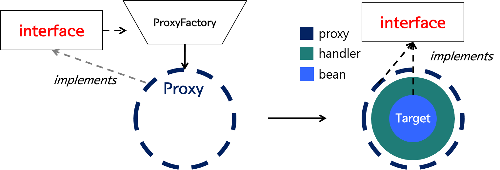
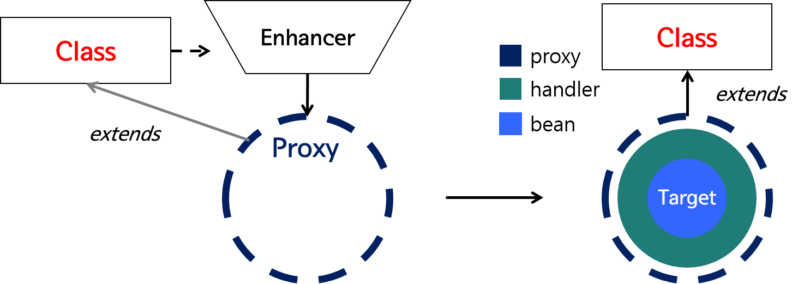

스프링에서 Jackson이 동작하는 방식과 AOP를 이용해서 private method를 pointcut으로 사용하는 법을 알아본다.

### Jackson Serialization
Jackson 라이브러리를 사용하면 @RequestBody 어노테이션을 통해 http request body를 객체로 매핑을 할 수 있다. 여기서 ObjectMapper를 사용하여 Serialization을 하는데 일단 이 클래스의 경우 Thread Safe 하기 때문에 굳이 매번 생성할 필요 없이 bean으로 등록해서 재사용하는 편이 좋다고 한다.

이 ObjectMapper가 어떻게 Serialize를 하는지 확인을 해본다. 우선 @ConstructorProperties가 붙어있는 생성자가 있으면 이 생성자를 먼저 실행하여 초기화를 한다. 만약 해당 생성자가 없으면 기본 생성자를 호출하여 Reflection으로 생성한다.
그리고 초기화되지 않은 필드들을 찾는다. 여기에서 get + 필드명이나 (boolean 타입의 경우는 isBoolean) set + 필드명으로 지정된 메소드들을 식별해서 호출하고 값을 넣어주는게 jackson의 동작 방식이다. 만약 둘다 없을 경우 값을 넣어주지 않으며 getter나 setter 둘중 하나만 있어도 동작을 한다. 만약에 getter만 있고 setter가 없어도 값을 넣어주는게 가능한데, setter가 있으면 setter를 이용하여 값을 넣어주지만 그렇지 않으면 reflection으로 필드에 직접 값을 넣어주기 때문이다.

반대로 객체를 JSON STRING으로 deserialize 할 경우는 getter만을 이용하여 필드 식별을 한다. 데이터를 가져와서 문자열로 만드는 것이기 때문에 setter는 사용하지 않는다.

### AOP
AOP는 Aspect Oriented Programming의 약자로, 각 클래스들에서 겹치는 작업들을 한 곳에 모아서 처리하는 프로그래밍이다. Spring 에서는 이 개념을 Spring aop를 제공하는 것으로 해결하고 있다. AOP의 경우는 프록시를 기반으로 동작하며 JDK Dynamic Proxy와 CGLIB을 활용하여 제공하고 있다.

두가지 중에 어떤 방식을 선택하는지는 아래와 같다. 즉 타겟의 인터페이스가 있냐 없냐에 따라 갈린다.

#### JDK Dynamic Proxy

JDK Dynamic Proxy 기반 동작은 위의 그림과 같다. Proxy클래스의 new ProxyInstance 메소드를 통해 타겟의 Interface를 상속하는 클래스의 객체를 생성한다.

#### CGLib

CGLIB은 클래스의 바이트코드를 조작하여 Proxy 객체를 생성해주는 방식이다. 클래스를 직접 상속하는 Proxy 클래스를 만들어서 객체를 생성하고 주입하는 방식이다. 성능자체는 JDK Dynamic Proxy보다 좋다. 기존에 한계가 있었는데 디폴트 생성자가 필요하다는 점이랑, 생성자를 두번 호출하는 점이었다.하지만 이 점또한 개선되면서 CGLIB이 SPRING BOOT에 공식적으로 들어와서 기본적으로 CGLIB으로 동작한다고 한다.

#### Private Method
그러면 Private Method를 AOP에서 호출할 땐 어떻게 하느냐가 관건이다. Reflection을 통해서 target 클래스를 상속하는 Proxy를 만들고, 이 객체를 생성해서 동작하는 방식인데 상속의 경우 private를 받지 못하기 때문에 문제가 발생한다. 결론적으로는 Spring AOP로는 불가능하다. AspectJ를 통해 컴파일 시점에서 Proxy 클래스 객체를 생성하고 AOP 처리하는 방법으로 해결해야한다.

참고
- https://umbum.dev/880
- https://velog.io/@conatuseus/RequestBody%EC%97%90-%EC%99%9C-%EA%B8%B0%EB%B3%B8-%EC%83%9D%EC%84%B1%EC%9E%90%EB%8A%94-%ED%95%84%EC%9A%94%ED%95%98%EA%B3%A0-Setter%EB%8A%94-%ED%95%84%EC%9A%94-%EC%97%86%EC%9D%84%EA%B9%8C-3-idnrafiw
- https://gmoon92.github.io/spring/aop/2019/04/20/jdk-dynamic-proxy-and-cglib.html
- https://stackoverflow.com/questions/15093894/aspectj-pointcut-for-annotated-private-methods