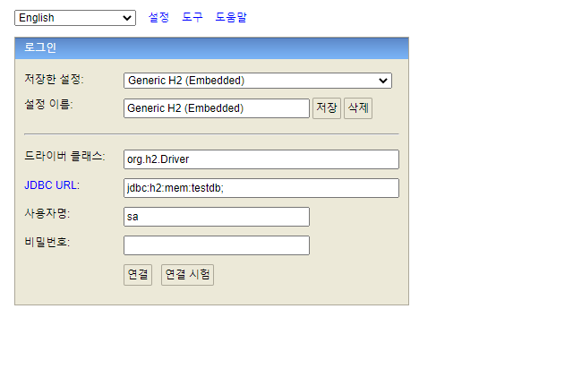

실전 스프링 데이터 JPA라는 강의를 들으면서 요약한 내용을  정리한다.

### Project Setting
[Spring initializer](https://start.spring.io/)에 들어가서 Spring과 Spring Data JPA 의존성이 담긴 프로젝트를 생성한다. 이 강의에선 maven이 아니라 gradle을 기반으로 동작하며, 스프링의 버전은 시간이 지나면 지날수록 계속 올라가기 때문에 생성하는 시점의 lts 버전을 기반으로 생성한다.

추가하는 의존성으로는 Spring Web, Spring Data JPA, lombok, h2가 있으며 개인적으로 필요한 부분이 있으면 추가해서 생성한다. 이렇게 생성하면 intellij 기반으로 동작을 할건데, intellij를 이용하여 다운로드 받은 프로젝트를 gradle project로 import한다

* 주의할점 : 처음 프로젝트를 import할 경우 gradle이 필요한 의존성을 import하는 동작을 intellij에서 수행할 것이다. 이때 gradle import가 실패하는 경우가 종종있는데 한두번 reimport 해보다가 안되면, gradle의 버전에 문제가 있을 수 도 있으니 이를 수정해서 reimport한다. 방법으로는 gradle-wrapper.properties 파일에서 distributionUrl에 적혀있는 gradle 버전을 낮춰서 import하면 동작 수행이 가능하다.

### H2 Setting
자바 기반의 RDBMS인 H2를 설치해서 간단하게 데이터의 CRUD를 수행할 수 있게 한다. 물론 실제로 운영상에서는 사용하지 않지만 간단히 테스트 할 때 유용하다.

http://www.h2database.com/html/main.html 에 들어가서 현재 스프링 프로젝트의 H2 의존성에 맞는 버전의 H2를 다운로드한다. 다운로드하고 h2를 실행하면 웹 화면에서 아래와 같은 실행 탭이 뜰 것이다.



이제 위의 화면에서 설정을 h2 server로 바꾼뒤, JDBC URL을 jdbc:h2:~/datajpa 이런 식으로 변경하면, H2 DB가 파일로 관리되면서 생성이 된다. 이렇게 db를 처음에 생성하고 난 이후로는 url을 다시 tcp로 바꿔서 연결을 진행한다. (ex) jdbc:h2:tcp://localhost/~/datajpa)

다음으로는 application.yml파일에 db정보를 적어준다.
```
server:
  port: 12345

spring:
  datasource:
    url: jdbc:h2:tcp://localhost/~/datajpa
    username: sa
    password:
    driver-class-name: org.h2.Driver

  jpa:
    database-platform=: org.hibernate.dialect.H2Dialect
    hibernate:
      ddl-auto: create
    properties:
      hibernate:
        show_sql: true
        format_sql: true
logging.level:
  org.hibernate.SQL: debug
```

이런 식으로 작성하면 스프링부트가 실행되면서 h2 db와 연동이 된다.

### 테스트
실제로 db와 연동이 되는지 테스트 코드를 작성해본다.
```
@Entity
@Getter @Setter
public class Member {
    @Id @GeneratedValue
    private Long id;
    private String userName;

    protected Member() {

    }

    public Member(String username) {
        this.userName = username;
    }
}

```
먼저 위와 같이 entity를 작성한다. 주의해야할 점으론 JPA에선 ENTITY에 기본생성자가 있어야 하며, 이 생성자의 접근 레벨은 최소 protected여야 하기때문에 private으로 정의하면 안된다. JPA에선 프록시를 이용하여 객체를 새로 생성해야하는데 private는 클래스 내에서만 사용이 가능하기 때문에 최소 protected여야지 객체 생성이 가능하다.

```
public interface MemberRepository extends JpaRepository<Member, Long> {
}

```
이렇게 JpaRepository를 상속하는 인터페이스를 하나 작성한다. 그리고 이 클래스에서 윈도우 기준 ctrl + shift + t를 누르면 테스트 클래스를 생성할 수 있다.

```
@SpringBootTest
@Transactional
class MemberRepositoryTest {
    @Autowired MemberRepository memberRepository;

    @Test
    public void testMember() {
        Member member = new Member("memberA");
        Member saveMember = memberRepository.save(member);

        Member findMember = memberRepository.findById(saveMember.getId()).get();

        assertThat(findMember.getId()).isEqualTo(member.getId());
        assertThat(findMember.getUserName()).isEqualTo(member.getUserName());
        assertThat(findMember).isEqualTo(member);
    }

}
```
이렇게 생성하고 테스트 수행했을 때 동작이 성공되면 문제없이 db 설정이 완료 된것이다. 위의 코드는 db에 직접 삽입하지 않고 영속성컨텍스트에만 저장하고 롤백하는 코드이며 만약 db에 직접 값을 반영하고 싶을 경우, @Rollback(false)를 해주면 된다. 해당 설정이후에는 직접 쿼리가 수행되는 걸 볼 수 있는데, 파라미터 정보가 나오지 않는다. 파라미터를 직접 출력하고 싶을경우, build.gradle파일에 "implementation 'com.github.gavlyukovskiy:p6spy-spring-boot-starter:1.7.1'"를 추가해주면 된다.

참고
- https://www.inflearn.com/course/%EC%8A%A4%ED%94%84%EB%A7%81-%EB%8D%B0%EC%9D%B4%ED%84%B0-JPA-%EC%8B%A4%EC%A0%84