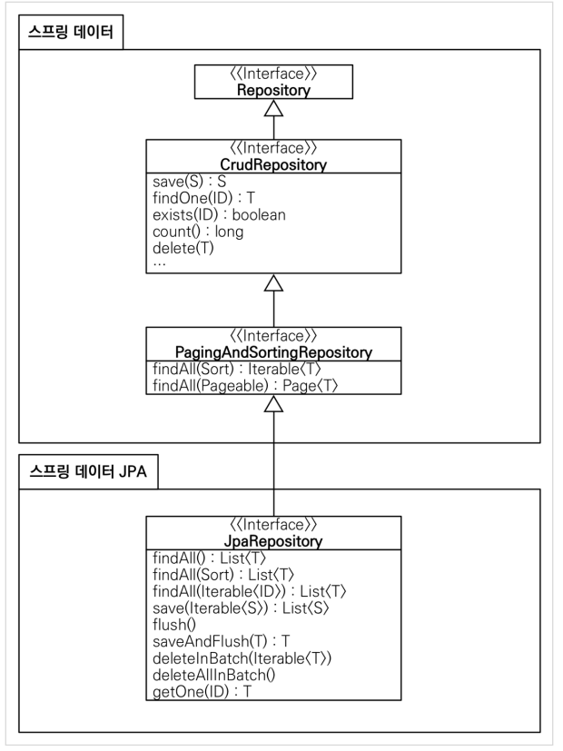

실전 스프링 데이터 JPA라는 강의를 들으면서 요약한 내용을  정리한다.

### JPA TEST
Spring data jpa가 아닌, jpa만을 이용해서 테스트코드를 한번 작성해본다.

```
@Entity
@Getter @Setter
@NoArgsConstructor(access = AccessLevel.PROTECTED)
@ToString(of = {"id", "userName", "age"})
public class Member {
    @Id @GeneratedValue
    @Column(name = "member_id")
    private Long id;
    private String userName;
    private int age;

    @ManyToOne(fetch = FetchType.LAZY)
    @JoinColumn(name = "team_id")
    private Team team;

    public Member(String username) {
        this.userName = username;
    }

    public Member(String userName, int age, Team team) {
        this.userName = userName;
        this.age = age;

        if (team != null) {
            changeTeam(team);
        }
    }

    public void changeTeam(Team team) {
        this.team = team;
        team.getMembers().add(this);
    }
}
```
위와 같이 member entity 코드를 작성한다. 아무 파라미터도 안쓰는 기본생성자가 jpa에 필요하기 때문에 lombok의 @NoArgsConstructor 기능을 이용하여 생성하고, access level은 최소 필요 조건인 protected로 설정한다.

```
@Entity
@Data
@NoArgsConstructor(access = AccessLevel.PROTECTED)
@ToString(of = {"id", "name"})
public class Team {
    @Id @GeneratedValue
    @Column(name = "team_id")
    private Long id;
    private String name;

    @OneToMany(mappedBy = "team")
    private List<Member> members = new ArrayList<>();

    public Team(String name) {
        this.name = name;
    }
}
```
Member와 일대다 관계를 맺은 Team 엔티티도 생성을 한다.

```
@Test
public void testEntity() {
    Team teamA = new Team("teamA");
    Team teamB = new Team("teamB");

    em.persist(teamA);
    em.persist(teamB);

    Member member1 = new Member("member1", 10, teamA);
    Member member2 = new Member("member2", 10, teamA);
    Member member3 = new Member("member3", 10, teamB);
    Member member4 = new Member("member4", 10, teamB);

    em.persist(member1);
    em.persist(member2);
    em.persist(member3);
    em.persist(member4);

    //초기화
    em.flush();
    em.clear();

    //확인
    List<Member> members = em.createQuery("select m from Member m", Member.class)
            .getResultList();
    for (Member member : members) {
        System.out.println("member : " + member);
        System.out.println("team : " + member.getTeam());
    }
}
```
그리고 EntityManager를 의존성 주입받아, 각 객체를 persist하고 flush 한다. flush는 영속성의 dirty checking을 수행하여 쿼리를 db에 날릴 수 있게 하는 역할 을 한다.

### Spring Data JPA를 이용한 REPOSITORY 생성
기존 JPA를 이용하여 REPOSITORY 코드를 제작하면 대강 아래와 같을 것이다.
```
public Optional<Member> findById(Long id) {
    Member m = em.find(Member.class, id);
    return Optional.ofNullable(m);
}

public void delete(Member member) {
    em.remove(member);
}

public List<Member> findAll() {
    return em.createQuery("select m from Member m")
            .getResultList();
}
```
매 CRUD마다 이런 작업을 해야한다는 것이 불편하기에 Spring Data JPA의 기능을 이용하여 단순화할 것이고, 이를 위해서 설정을 진행한다.

```
public interface MemberRepository extends JpaRepository<Member, Long> {
}
```
Spring Data JPA를 이용하여 Repository 인터페이스를 만들어 놓으면, 단순한 CRUD 구현 코드는 작성할 필요가 없이 동작 가능하다. 해당 인터페이스 구현체를 런타임에 Spring Data JPA가 프록시 객체로 구현체를 만들어서 CRUD 코드를 작성하기 해주기 때문에 상속만 해서 정의해놓으면 사용이 가능하다. 인터페이스 정의만 하면 @Repository 어노테이션이 없어도, Spring Data JPA가 인터페이스를 읽어들여서 구현체를 생성하고, 빈으로 등록작업을 하기 때문이다. 추가적으로 @Repository 어노테이션이 달렸을 경우, JPA의 EXCEPTION을 SPRING의 EXCEPTION으로 바꿀수 있게 동작한다고 하는데 이또한 SPRING DATA JPA가 해주는 것으로 보인다.

### Spring Data JPA 인터페이스 분석
Repository를 생성하기위해 상속하는 JpaRepository를 들어가보면, PagingAndSortingRepository와 QueryByExampleExecutor를 상속하는 구조이다. PagingAndSortingRepository는 Paging을 위한 인터페이스로 어떤 db든 비슷한 동작을 하기때문에 spring-data-commons 라이브러리에 들어가있다. PagingAndSortingRepository는 다시 CrudRepository를 상속하는데 이 인터페이스는 기본적인 save, findById 등이 정의되어있다. 이 CrudRepository는 Repository 인터페이스를 상속하는데 이 인터페이스는 마커 인터페이스로, Spring이 스캔하기 쉽게 해주는 인터페이스라고 한다.



주요메소드는 아래와 같다.
- save : 새 엔티티는 저장하고, 이미 있는 엔티티는 병합
- delete : 엔티티를 삭제
- findById : ID로 엔티티를 조회
- getOne : 엔티티를 프록시로 조회
- findAll : 모든 엔티티를 조회하며, Sort와 Pageable을 이용할 수 있음

참고
- https://www.inflearn.com/course/%EC%8A%A4%ED%94%84%EB%A7%81-%EB%8D%B0%EC%9D%B4%ED%84%B0-JPA-%EC%8B%A4%EC%A0%84