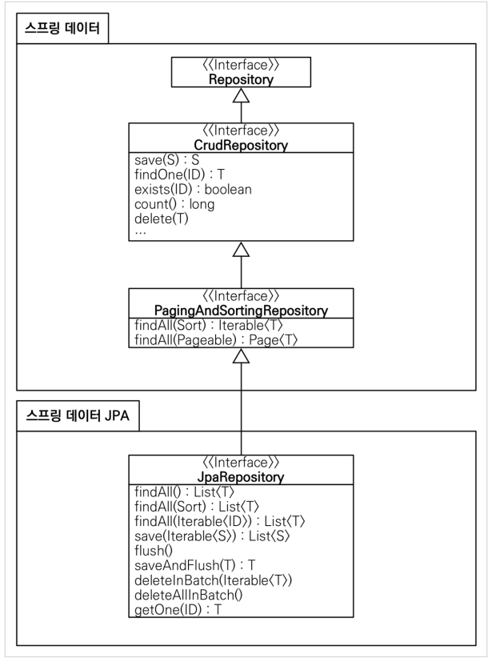

실전 스프링 데이터 JPA라는 강의를 들으면서 요약한 내용을  정리한다.

### 쿼리 메소드
Spring Data JPA는 쿼리 메소드 기능을 제공한다. 이 기능은 메소드의 이름만으로 필요한 쿼리를 만들어내는 기능이다.

방법이 3가지 정도가 있는데 하나씩 알아본다

#### 메소드 이름으로 쿼리 생성

가능한 메소드를 확인해볼 경우 https://docs.spring.io/spring-data/jpa/docs/current/reference/html/#repositories.query-methods.query-creation 로 들어가면 된다.

컨벤션은 find...By 로 해서 찾고자하는 엔티티와 조건 필드명을 잘 입력해서 메소드를 정의하면 조건에 맞는 엔티티들을 가져온다. '...'의 경우는 굳이 엔티티 명이 아니어도 된다.
만약 엔티티 조회가 아니라 개수를 조회하고 싶으면 find를 count로 바꾸면 되고, 단순히 존재하는지만 체크하고 싶을 경우 exists를 사용하면 된다. 삭제의 경우는 delete나 remove를 사용하며, Distinct를 사용하고 싶을 경우 find...Distinct 이런식으로 컨벤션을 지켜주면 jpql이 생성된다. LIMIT의 경우는 FIRST n, Top n 등 이런식으로 FIRST나 TOP등의 키워드를 이용해서 메소드명을 정의해주면 된다.


#### 메소드 이름으로 JPA Named Query 호출
해당 부분은 실무에서 쓸일이 별로 없다고는 하지만 일단 기능은 있기 때문에 정리 해본다.

쿼리의 대상 엔티티에 쿼리를 직접 작성한다.
```
@org.hibernate.annotations.NamedQuery(
        name = "Member.findByUserName",
        query="select m from Member m where m.userName = :userName"
)
```
그리고 난 이후 일반적인 JPA만을 이용했을 때는, entityManager에 createNamedQuery 기능을 이용하여 해당 메소드를 호출한다.

```
public List<Member> findByUserName(String userName) {
    return em.createNamedQuery("Member.findByUserName", Member.class)
            .setParameter("userName", userName)
            .getResultList();
}
```

위와 같이 작성하면, 해당 이름을 가진 namedQuery를 직접 호출하여 jpql을 이용한 쿼리를 수행한다.

```
@Query(name = "Member.findByUserName")
List<Member> findByUserName(@Param("userName") String userName);
```
Spring Data JPA의 경우, MemberRepository 인터페이스에 Query 어노테이션을 붙인 메소드를 하나 선언해주고, 파라미터를 직접 명시해주면 동일하게 동작한다.

사실 '@Query(name = "Member.findByUserName")' 이 부분이 없어도 제대로 동작을 한다. 네이밍 컨벤션에서 '엔티티명.메소드명'을 맞춰서 지었을 경우, Spring Data JPA 에서 Named query를 먼저 찾고 없을 경우 이름에 맞는 jpql을 생성하는 동작을 하기 때문에 Named Query를 찾아서 수행을 하는 것이다.

해당 방법에도 장점이 있는데, NamedQuery의 경우, 애플리케이션의 로딩시점에 파싱을 해보기 때문에 잘못된 작성이었을 경우 버그를 잡을 수 있다.

#### Query 어노테이션으로 레포지토리 메소드에 적용하기
Spring Data JPA에선 메소드에 동작하는 Query를 직접 지정할 수 있다.

```
@Query("select m from Member m where m.userName = :userName and m.age = :age")
List<Member> findUser(@Param("userName") String userName, @Param("age") int age);
```

이렇게 jpql을 Query 어노테이션 안에 작성하고 메소드를 만들어 주면, 해당 메소드가 jpql을 실행한다. 만약 쿼리 자체가 잘못되었을 경우, NamedQuery와 마찬가지로 애플리케이션이 로딩할때 jpql을 파싱하면서 에러를 내준다.

뿐만 아니라, 메소드의 네이밍 컨벤션에 맞춰서 jpql을 생성해준다 해도, 조건이 많을 수록 매우 메소드명이 길어지기 때문에 jpql을 직접 작성하고 매핑하는 방법이 코드가 깔끔해진다는 장점이 있다.

위의 방법의 경우는 Entity에 직접 결과를 받아오는 경우인데, dto로 직접 받아오고 싶을 수도 있다.

그러면 일단 dto를 먼저 정의한다.

```
@AllArgsConstructor
@Data
public class MemberDto {
    private Long id;
    private String userName;
    private String teamName;
}
```

그리고 난 이후, dto의 new를 이용한 생성자를 직접 jpql에서 호출하여 매핑하면 해당 생성자가 동작하면서 새로운 dto 객체를 생성한다.

```
@Query("select new spring.datajpa.dto.MemberDto(m.id, m.userName, t.name) from Member m join m.team t")
List<MemberDto> findMemberDto();
```

#### 페이징
우선 JPA를 통해 페이징 하는 방법을 살펴본다.

```
public List<Member> findByPage(int age, int offset, int limit) {
    return em.createQuery("select m from Member m where m.age = :age order by m.userName desc")
            .setParameter("age", age)
            .setFirstResult(offset)
            .setMaxResults(limit)
            .getResultList();
}

public long totalCount(int age) {
    return em.createQuery("select count(m) from Member m where m.age = :age", Long.class)
            .setParameter("age", age)
            .getSingleResult();
}
```

age를 기반으로 페이징을 한다면, 우선 조건을 설정하며, setFirstResult에 어디서 부터 가져올지 offset을 넘겨준다. 그리고 maxResult로 최대 개수를 설정해서 조건에 맞는 객체들을 가져온다. 이렇게 해서 offset과 limit을 설정하고, 페이징의 경우는 전체 몇 중에 몇 까지 표시를 해야하기 때문에 전체 개수도 조회하는 쿼리를 작성한다. 이런 식으로 JPA를 이용하여 페이징을 수행한다.





참고
- https://www.inflearn.com/course/%EC%8A%A4%ED%94%84%EB%A7%81-%EB%8D%B0%EC%9D%B4%ED%84%B0-JPA-%EC%8B%A4%EC%A0%84