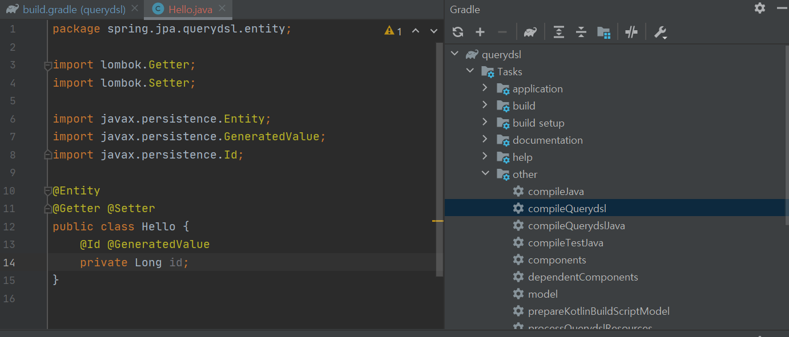

실전 querydsl이라는 강의를 듣고 요약한 내용을 정리한다.

### Project Setting
우선 build.gradle 파일에 의존성 설정을 해야한다.
```
plugins {
	...

	id "com.ewerk.gradle.plugins.querydsl" version "1.0.10"
}
```

plugin에 querydsl 플러그인을 추가한다.

```
dependencies {
  ...

	implementation 'com.querydsl:querydsl-jpa'
}
```
그리고 의존성에 querydsl-jpa를 추가한다.


```
def querydslDir = "$buildDir/generated/querydsl"

querydsl {
	jpa = true
	querydslSourcesDir = querydslDir
}
sourceSets {
	main.java.srcDir querydslDir
}
configurations {
	querydsl.extendsFrom compileClasspath
}
compileQuerydsl {
	options.annotationProcessorPath = configurations.querydsl
}
```

그리고 위와 같이 querydsl 컴파일 관련 설정을 한다. 위의 build.gradle에 담긴 코드를 분석해본다.



intellij에서 task -> other -> compileQuerydsl을 누르면 @Entity가 있는 클래스들을 스캔해서 이에 대한 q클래스를 만드는 작업이 compileQuerydsl 테스크에서 동작한다. querydslDir이 이 클래스들이 생성될 위치를 의미한다.

querydsl의존성에는 querydsl-apt와 querydsl-jpa가 존재하는데, apt의 경우는 q클래스를 만들어주는 라이브러리이고, jpa의 경우는 쿼리를 실제로 만들어주는 라이브러리이다. 

```
spring:
  datasource:
    url: jdbc:h2:tcp://localhost/~/querydsl
    username: sa
    password:
    driver-class-name: org.h2.Driver

  jpa:
    hibernate:
      ddl-auto: create
    properties:
      hibernate:
        format_sql: true
logging.level:
  org.hibernate.SQL: debug

```
그리고 위와 같이 application.yml을 작성하면 설치된 db에 직접 연결할 수 있다. test클래스를 통해 연결을 할수 있으며, 

```
@SpringBootTest
@Transactional
@Commit
```
이런식으로 테스트 클래스에 어노테이션을 달아두면 실제 db에 롤백하지 않고 쿼리를 날릴 수 있다.

```
implementation 'com.github.gavlyukovskiy:p6spy-spring-boot-starter:1.5.8'
```
실제 수행되는 쿼리의 파라미터를 확인하고 싶을 경우 위와 같은 의존성을 추가해주면 확인할 수 있다.

### querydsl 문법
```
@Test
  public void startJPQL() {
      Member findMember = em.createQuery("select m from Member m where m.userName = :userName", Member.class)
              .setParameter("userName", "m1")
              .getSingleResult();

      assertThat(findMember.getUserName()).isEqualTo("m1");
  }
```

만약 jpa를 사용하여 member라는 엔티티를 조회한다면 위와 같이 jpql을 짜서 조회를 할것이다.

```
@Test
public void startQueryDsl() {
    JPAQueryFactory queryFactory = new JPAQueryFactory(em);
    QMember m = new QMember("m");

    Member findMember = queryFactory
            .select(m)
            .from(m)
            .where(m.userName.eq("m1"))
            .fetchOne();

    assertThat(findMember.getUserName()).isEqualTo("m1");
}
```
반면에 querydsl을 사용하면, 컴파일 시점에 생성된 q클래스로 queryFactory에 넘겨서 실제 쿼리문과 비슷하게 자바코드로 구현을 해서 조회쿼리를 수행할 수 있다. q클래스에서 필드의 eq를 사용하면 preparestatemant 에 파라미터 바인딩이 된다.

jpa와 querydsl을 비교하다 보면, jpql에서 쿼리를 잘못 작성했을 경우, 런타임시점에 실제로 jpql이 실행되었을때 찾을수 있는 반면에 querydsl은 컴파일 시점에 잘못된 쿼리를 잡아낼 수 있기 때문에 이런 점이 매우 편리하다.

```
QMember m = QMember.member;
```
q클래스의 활용법은 기본적으로 위와 같이 사용을 할 수 있다. q클래스가 생성되면 자동적으로 정적 필드에 본인 변수가 생성되기 때문에 이 값을 그대로 가져오거나

```
memeber
```
를 입력하고 static import를 한다.

```
QMember m = new QMember("m");
```
만약 같은 테이블을 여러번 조인해야하는 경우가 생긴다면 이름을 구분해줘야하기 때문에 위와같이 이름을 직접 할당해서 변수를 생성한다.

만약 querydsl의 jpql도 보고 싶다면 spring.jpa.hibernate.use_sql_comment: true를 application.yml파일에 부여해서 사용하면 된다.

```
Member m1 = queryFactory
                .selectFrom(member)
                .where(member.userName.eq("m1")
                        .and(member.age.eq(10)))
                .fetchOne();
```
검색 조건 같은 경우, where 안에 chain으로 여러 조건을 넣어도 되고, ','로 and 조건을 여러개 부여할 수도 있다.


#### 결과 조회
querydsl 에서 결과 조회하는 방법이 몇가지 있는데 이 방법들이 동작하는 것을 확인해본다.
- fetch() : 리스트 조회. 없으면 빈 리스트 반환
- fetchOne() : 없으면 null, 결과가 하나 이상이면 NonUniqueResultException 발생
- fetchFirst() : limit(1) 과 같이 하나만 반환
- fetchResults() : 페이징 정보 포함하여 반환. 결과숫자도 조회. 다만 숫자 조회하는 쿼리 최적화를 필요로 할 경우에는 fetch를 사용하고 count쿼리를 따로 수행
- fetchCount() : count쿼리로 변환해서 수만 조회

#### 정렬 & 페이징
```
List<Member> fetch = queryFactory
                .selectFrom(member)
                .where(member.age.eq(100))
                .orderBy(member.age.desc(), member.userName.asc().nullsLast())
                .fetch();
```
단순 정렬을 할 경우, 필드 명 + desc/asc 를 이용하여 정렬 기준을 사용할 수 있고, 여러개일 경우 ','로 구분한다.

페이징이 필요할 경우 offset과 limit으로 페이징을 하면 된다.

#### 집합
```
List<Tuple> fetch = queryFactory
        .select(
                member.count(),
                member.age.sum(),
                member.age.avg(),
                member.age.max(),
                member.age.min()
        )
        .from(member)
        .fetch();
Tuple tuple = fetch.get(0);
```

테이블의 총 수, 특정 컬럼의 합 이런 값들이 필요할 경우 위와 같이 필드명 뒤에 원하는 함수를 표기하면 되고, 이렇게 해서 결과를 fetch 할 경우 tuple로 반환한다.

```
List<Tuple> fetch = queryFactory
  .select(team.name, member.age.avg())
  .from(member)
  .join(member.team, team)
  .groupBy(team.name)
  .fetch();
```
groupby의 경우는 위와 같이 작성을 하면 된다.

#### 조인
```
queryFactory
  .selectFrom(member)
  .join(member.team, team)
  .where(team.name.eq("teamA"))
  .fetch();
```
querydsl 에선 join을 위와 같이 연관관계에 있는 객체 필드로 조인할 수 있다.

다만 연관관계에 있는 필드만 조인할 수 있는 것은 아니고, 

```
queryFactory
  .select(member)
  .from(member, team)
  .where(member.userName.eq(team.name))
  .fetch();
```
이런 식으로 연관관계가 아닌 것도 가능한 세타 조인이 가능하다. 즉 카테시안 프로덕트로 테이블간 연산을 해서 행을 구한다음, where로 필터를 하는 것이다.

on절을 활용해서도 join을 할 수 있는데, on절을 활용하는 경우는 컬럼을 필터링하거나, 연관관계가 없는 테이블들을 조인할때 사용한다.

만약 on을 사용할때 innerjoin을 사용하면 join하지 않는 필드들은 가져오지 않기 때문에 where절을 사용하는 것과 같다. leftjoin의 경우는 join을 하지 않아도 null필드로 연관관계를 가져오면서 테이블을 조회하는 것이기 때문에 where와는 처리 방법이 다르다.

```
List<Tuple> list = queryFactory
                .select(member, team)
                .from(member)
                .leftJoin(team).on(member.userName.eq(team.name))
                .fetch();
```
관계가 없는 컬럼을 이용하여 조인을 하고 싶을 경우는 위와 같이 사용하면 된다. on절을 사용하여 leftjoin을 할 경우, leftjoin 안에 엔티티는 다른 조인들과 다르게 단 한개만 들어간다.

```
@PersistenceUnit
EntityManagerFactory emf;

@Test
public void fetchJoinNo() {
    em.flush();
    em.clear();

    Member m1 = queryFactory
            .selectFrom(member)
            .where(member.userName.eq("m1"))
            .fetchOne();

    boolean loaded = emf.getPersistenceUnitUtil().isLoaded(m1.getTeam());
    assertThat(loaded).as("패치조인 미적용").isFalse();
}
```
join을 할때 fetchjoin을 사용하지 않았을 경우, 연관관계에 있는 필드는 lazy로딩이기 때문에 참조하지 않았을 땐 데이터를 조회하지 않은 상태이고 이는 EntityManagerFactory의 getPersistenceUnitUtil에서 isLoaded를 통해 확인해볼 수 있다.
fetch join을 querydsl에서 사용할 경우는 이 값이 true로 바뀐다.


#### 서브쿼리
JPAExpressions를 사용하면 querydsl에서 서브 쿼리를 사용할 수 있다.
```
QMember sub = new QMember("sub");
List<Member> fetch = queryFactory
        .selectFrom(member)
        .where(member.age.eq(
                JPAExpressions.select(sub.age.max())
                        .from(sub)
        ))
        .fetch();
```
이런 식으로 wherer 조건 안에 JPAExpressions를 하나 더 사용하여 subquery를 수행한 결과를 where절에 사용할 수 있다. subquery에서 사용할 member와 조회할 member는 다르기 때문에 새로운 q클래스의 객체를 하나 생성해준다.

JPA에서 SUBQUERY는 select 절이나 where절에선 가능하지만 from에서 사용이 불가능하다. select 절의 서브 쿼리도 jpa가 지원하는 것은 아니고 hibernate의 구현체가 지원을 해줘서 가능한 부분이다.
from 절의 서브 쿼리 같은경우 해결책은 join으로 변경하거나, 따로 쿼리를 분리해서 실행하는 방법도 있고, 아예 한번에 실행해야될 경우는 native sql을 사용해야한다.

#### case & 상수,문자 더하기
```
List<String> list = queryFactory
                .select(new CaseBuilder()
                        .when(member.age.between(0, 20)).then("0~20")
                        .when(member.age.between(21, 30)).then("21~30")
                        .otherwise("기타"))
                .from(member)
                .fetch();
```
sql이나 jpql 에서 사용하는 case는 casebuilder를 통해서 사용하거나, 단순한 경우는 when then만 이용하여 구현한다.

```
List<Tuple> a = queryFactory
                .select(member.userName, Expressions.constant("A"))
                .from(member)
                .fetch();
```
상수 같은 경우는 Expressions의 constant를 사용하면 된다.

```
List<String> fetch = queryFactory
                .select(member.userName.concat("_").concat(member.age.stringValue()))
                .from(member)
                .fetch();
```
concat의 경우에는 단순하게 concat만 사용하면 안되고, 타입을 맞춰줘야하기 때문에 string 타입이 아닐 경우 stringvalue를 호출해서 string으로 변환하고 concat을 해야한다.
enum 처리할땐 StringValue를 사용할 일이 많다.

참고
- Querydsl 실전 강의