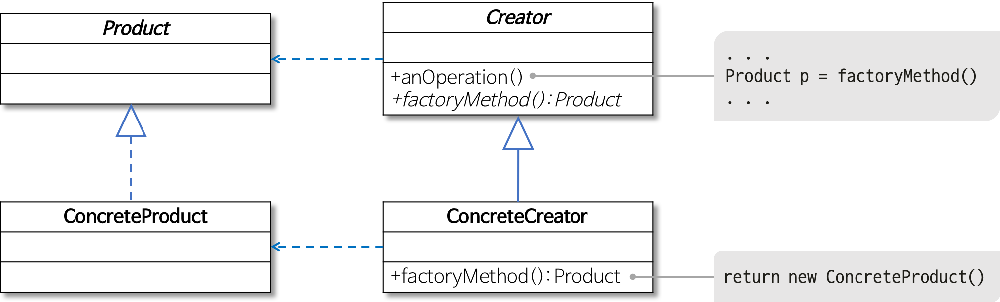

자바를 기반으로 디자인 패턴을 알아본다.

### 팩토리 메소드 패턴
객체 생성을 캡슐화하는 패턴이다.



위의 그림이 팩토리 메소드패턴을 적용한 uml이다. Creator라는 인터페이스에 factoryMethod 메소드를 정의해서 Product라는 클래스의 객체를 반환하게 하며, 이를 구체적으로 구현한게 ConcreteCreator클래스이다.

위의 그림에서는 ConcreteCreator클래스 하나만 Creator를 상속하지만, Product를 생성하는 비즈니스로직이 다를 경우, 이를 커버하는 Creator클래스를 정의할 수 있으며, 하나의 비즈니스로직에서도 분기에 따라서 Product를 다르게 생성해야할 경우 Product 클래스를 상속하는 서브 클래스의 인스턴스를 생성하는 로직을 구현할 수 있다.

### 추상 팩토리 패턴
이름을 봐선 팩토리 메소드 패턴과 비슷해 보이는데 여기엔 차이점이 존재한다.


팩토리 메소드 패턴으로 구현을 한다면, 메소드 안에 if/else 분기처리로 어떤 객체 타입으로 생성할지 정해야 하는데, 이 패턴 같은 경우는 타입마다 팩토리를 생성하여 해당 타입을 생성하게 한다.


### 정적 팩토리 메소드 패턴
객체 생성하는 메소드를 클래스의 static메소드로 선언하는 기법이다. 팩토리 메소드 패턴과 이름이 비슷하기 때문에 헷갈릴 수도 있지만 메소드가 객체를 생성한다는 것 이외에는 공통점이 없다.

```
class Member {
    // 정적 팩토리 메소드
    public static Member newWarrior() {
    return new Character(5, 15, 20, 3);
    }

    // 정적 팩토리 메소드
    public static Member newMage() {
    return new Character(15, 5, 10, 15);
    }
}
```

이런식으로 비즈니스 로직별 객체 생성하는 메소드를 구현하는 패턴이다.

#### 생성자와의 차이점
사실 정적 팩토리 메소드를 굳이 사용해야 되냐 라고 반문을 할 수 도 있다. 하지만 이 패턴을 이용한 장점이 존재한다.

우선 생성자 같은 경우는 파라미터의 위치에 따라서 값을 넣는 방식이기 때문에 이 생성자가 어떤 때에 사용되는 생성자인지 사용자는 보고 모를 수 있다. 반면에 정적 팩토리 메소드 패턴같은 경우에는 메소드 명이라는 특징이 하나 있기 때문에, 메소드 명을 기반으로 어떤 때에 사용하는 객체 생성인지 사용자가 알 수 있게 정의할 수 있다.

```
public static final BigInteger ZERO = new BigInteger(new int[0], 0);

private final static int MAX_CONSTANT = 16;
private static BigInteger posConst[] = new BigInteger[MAX_CONSTANT+1];
private static BigInteger negConst[] = new BigInteger[MAX_CONSTANT+1];

static {
    /* posConst에 1 ~ 16까지의 BigInteger 값을 담는다. */
    /* negConst에 -1 ~ -16까지의 BigInteger 값을 담는다. */
}

public static BigInteger valueOf(long val) {
    // 미리 만들어둔 객체를 리턴한다
    if (val == 0)
        return ZERO;
    if (val > 0 && val <= MAX_CONSTANT)
        return posConst[(int) val];
    else if (val < 0 && val >= -MAX_CONSTANT)
        return negConst[(int) -val];

    // 새로운 객체를 만들어 리턴한다
    return new BigInteger(val);
}
```

또한 위의 코드는 자바의 BigInteger 클래스 코드인데 보면 알 수 있듯이, final로 미리 자주사용하는 값을 변수로 정의하고, 필요할 때마다 객체 생성을 하는 것이 아니라 기존 객체의 값을 이용하여 연산을 수행한다. 즉 객체 생성 비용이 줄어든다.

번외로 @RequiredArgsConstructor(staticName = "of")라는 lombok의 어노테이션을 사용하면 해당 패턴을 적용한 메소드를 구현해준다고 한다.

### 템플릿 메소드 패턴


템플릿 메소드 패턴은 위의 그림과 같은 구조로 확인할 수 있는데, 알고리즘이 필요한 메소드들을 정의만해놓고, 이 메소드들을 호출하는 메소드를 하나 구현을 한다. 그리고 핵심 알고리즘이 필요한 메소드들을 하위 클래스에서 상속하면서 실제로 구현하는 패턴을 의미한다.

이 패턴의 장점으로는, 특정 조건에 따라 달라지는 알고리즘은 하위 클래스에서 정의하고, 공통적으로 구현하는 메소드들은 상위 클래스에서 정의해서 사용하면 되기 때문에 중복 코드 제거에 효과적이라는 것이다. 예를 들어 양념치킨과 숯불 치킨을 구현한다고 쳐보자. 둘다 치킨이지만 양념치킨은 양념을 바르고 튀기는 행위를 하고 숯불 치킨은 굽는 행위를 한다. 하지만 이 두가지 치킨의 공통점으로는 닭을 손질한다는 것이 있다. 따라서 이 닭손질을 공통으로 넣고 조리법을 하위에서 각각 구현해주면 중복코드를 제거할 수 있다.

### 빌더 패턴
팩토리 메소드 패턴을 이용하여 객체를 생성한다면, 파라미터의 순서에 따라서 객체 생성이 달라져야하기 때문에 이를 구분하기가 어렵다. 그리고 불필요한 값들을 채워줘야하는 경우도 있는데 이를 해결하기 위한 패턴이 빌더 패턴이다.

빌더 패턴은 static 클래스를 클래스안에 정의하고, 이름을 관례적으로 Builder를 뒤에 붙인다. 그리고 각 속성마다 값을 넣어주는 메소드를 정의하고, 이 메소드의 리턴값이 빌더 자신이어야하며, 마지막 단계로 build를 호출했을 때 클래스의 객체를 반환하는 패턴이다.

### 어댑터 패턴
한 클래스의 인터페이스를 다른 인터페이스로 변환하는 패턴을 의미한다.


사용자는 target interface를 이용하여 adapter에 넘겨주면 어뎁터는 adaptee로 변환해서 데이터를 넘겨준다.

이 패턴을 사용하는 이유는 기존 인터페이스를 사용하고 싶지만, 새로운 것을 끌어다 쓸 때 변환이 필요하기 때문에 adapter에서 변환해서 사용하는 것이다.

### 커맨드 패턴
실행될 기능을 캡슐화해서, 기능이 변경 되더라도 호출하는 쪽에서는 영향을 적게 만들어주는 패턴이다.


위의 그림과 같이 호출자는 Command라는 인터페이스의 서브클래스를 가져다가 데이터를 넣어서 넘겨주면 수신자는 인터페이스로 받아서 비즈니스 로직을 처리한다.

### 전략 패턴
핵심 알고리즘을 클래스로 묶어서, 이를 객체 필드로 할당하고 객체는 이 필드의 알고리즘이 구현된 메소드를 호출해서 실행하는 패턴이다.


위의 그림과 같이 context에서는 실제 실행할 전략은 런타임에 결정될수 있게 인터페이스로 필드에 들고 있다가, 실제 실행하기 전에 로직에 맞는 구현체를 전략으로 넣고, 이를 실행하는 패턴이다.

커맨드 패턴과 좀 헷갈릴 수도 있는데, 커맨드 패턴은 호출할때 인터페이스를 구현한 서브 클래스의 메소드를 호출하면, 수신자의 기능을 수행하는 것을 의미하는 반면에 전략 패턴은 인터페이스의 구현클래스 메소드 기능 그자체를 수행한다.

### 비지터 패턴
기능을 적용해야할 객체의 대상들은 잘 바뀌지 않지만, 적용할 알고리즘이 추가될 가능성이 많은 상황일때 사용하면 좋은 패턴이다.


전략 패턴 같은 경우는 하나의 객체에 여러동작할때 (1:N), 커맨드 패턴은 하나의 객체에 대해서 하나의 동작에 대한 설계방식(1:1), 방문자 패턴은 여러 객체들에 대한 객체의 동작을 지정하는 방식(N:M)으로 구분하는 방법도 있다고 하니 참고하면 좋을 듯 하다.

visitor 패턴의 예시로는 문서가 있다. 문서는 xml과 json으로 구성된다고 해보자. 그러면 이 문서를 프로세싱하기 위해선 xml과 json 파일을 방문하면서 처리해야한다. 그리고 이 처리방식은 각각 요소에 따라 다를 것이다. 따라서 이럴 때 visitor 패턴을 사용한다고 한다.


참고
- https://johngrib.github.io/wiki/factory-method-pattern/
- https://gmlwjd9405.github.io/2018/08/07/factory-method-pattern.html
- https://gmlwjd9405.github.io/2018/07/13/template-method-pattern.html
- https://victorydntmd.tistory.com/300
- https://en.wikipedia.org/wiki/Abstract_factory_pattern
- https://dzone.com/articles/abstract-factory-pattern-in-java
- https://readystory.tistory.com/121
- https://yaboong.github.io/design-pattern/2018/10/15/adapter-pattern/
- https://gmlwjd9405.github.io/2018/07/07/command-pattern.html
- https://gmlwjd9405.github.io/2018/07/06/strategy-pattern.html
- https://blog.naver.com/2feelus/220664244510
- https://thecodinglog.github.io/design/2019/10/29/visitor-pattern.html
- https://www.baeldung.com/java-visitor-pattern