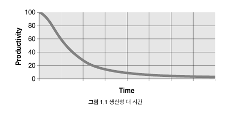

클린코드 책을 보고 내용을 요약한다.

### 깨끗한 코드



나쁜 코드가 쌓일 수록 팀의 생산성은 떨어진다. 위의 그림처럼 나쁜 코드가 쌓이다보면 시간이 지날 수록 생산성이 0에 가까워진다.

나쁜 코드를 짜지 않기 위해선 좋은 코드를 짜야하는데 좋은 코드의 방향중 한가지는 한 가지 일을 잘하는 것이 좋은 코드라고한다. 즉 객체지향 원칙의 단일 책임의 원칙 처럼 무언가 한 가지의 기능에 대한 수행을 정확히 하는 것을 좋은 코드라고 한다. 
또한 다른 방면으로는 코드가 직접적으로 어떤 일을 하는지 보이게끔 짜는게 좋은 코드라고도 한다. 그리고 다른 사람이 고치기 쉽게 짠 코드가 좋은 코드라고도 할 수 있다.

클린 코드에선 위와 같이 다른 사람들이 언급한 좋은 코드에 대한 설명을 적어 놓고 좋은 코드를 짜기 위한 방법에 대한 설명을 시작한다.

우선 코드를 읽기 쉽게 작성한다. 그리고 구현한 이후에 좋은 퀄리티를 유지하기 위해 지속적으로 변수의 이름 개선 및 긴 함수의 분할, 중복 제거 등등을 진행하는 면이 좋다.

### 의미가 있는 이름

읽기 쉽게 코드를 작성하기 위해선 읽고나서 의미를 파악할 수 있게 이름을 잘 짓는 것이 중요하다.

```
int d;
```

위와 같이 변수 선언을 하면 무슨 동작을 하는지 알수가 없다.

```
int daysSinceModification;
```

- 위와 같이 변수명을 가져가면 어떤 변수인지 주석이 없더라도 대강 짐작을 할 수 있다. 이렇게 의도가 드러나는 이름을 사용하는 것이 좋다.

- 이름을 지을 때에 잘못된 의미를 지닌 이름을 지으면 안된다. 단순히 복수라고 해서 List 타입을 사용하지 않는데 accountList같이 이름을 지으면 그것 또한 잘못된 의미부여라고 할 수 있다.

- 소문자 L을 사용하면 숫자 1처럼 보이기도 하고 대문자 O는 0과 구분하기가 비교적 어렵기 때문에 이렇게 헷갈리는 문자는 사용하지 않는 편이 좋다.

- 

위와 같이 함수를 정의한다면 파라미터 a1과 a2가 어떤 용도인지 전혀 알지 못한다. 하지만 이 변수들의 명칭을 각각 source와 dest로 짓는다면 좀 더 명확해진다. 이런 식으로 변수명을 짓기 귀찮아서 아무 이름을 짓는 것보다는 의미가 있는 단어로 짓는 편이 좋다.

- Info나 Data 같은 불용어를 추가한 이름 또한 의미가 적다. 어차피 객체에 데이터를 담아서 관리하기 위해 클래스를 만든 것이기 때문에 Info나 Data가 큰 의미를 갖지 않는다. 따라서 굳이 붙일 필요가 없다.

- 서로 소통하고 유지보수하기 쉽게 발음하기 쉽고, 검색하기 쉬운 이름으로 짓는 것이 좋다.

- 인터페이스와 구현체 클래스의 이름을 지을 때는 인터페이스 쪽에 접두어를 붙이지 않는 편을 추천한다. 인터페이스를 그냥 사용하고 나중에 실구현체를 주입하는 편이 좋기 때문에 IFactory와 Factory 보다는 Factory와 FactoryImpl같은 명칭이 더 좋다.

- 클래스 이름은 동사를 사용하지 않고 명사구로 짓는 편이 좋으며 메서드이름은 반대로 동사구를 사용하는 것이 좋다. 생성자를 중복정의해야한다면 정적 팩토리 메서드를 정의하여 사용하는 인수를 설명하는 이름을 사용하는 것이 좋다.

예를 들어 Shape.FromLength() 같이 만드는 것이 좋다. 그리고 실제 생성자는 private로 제한해두는 것이 좋다.

- 남들이 잘 사용하지 않는 본인만의 독창적인 언어를 사용하지 않는 편이 좋다. 

- 한 개념에 한 단어를 사용하는 것이 좋다. 데이터를 가져오는 메소드를 정의할때 어느 한곳에 get을 사용했다면 다른 곳에서도 get을 사용해서 메소드를 정의하는 것이 좋다.

- 본인이 적용한 해법을 나타내는 이름을 사용하는 것이 좋다. 예를 들어 디자인 패턴을 적용해서 구현을 했으면 해당 패턴을 나타내는 이름을 클래스 명에 부여하는 것이 좋다. 만약 해법이 적당한 명칭이 없으면 문제의 이름을 가져와서 짓는 것이 좋다.

- 의미있는 맥락을 추가하여 의미를 좀더 명확하게 한다. 단순히 state라는 이름을 지으면 애매하지만 addrState라는 맥락을 적용한 이름을 지으면 주의 주소라는 명확한 사실을 인지할 수 있다.


### 함수

프로그램의 가장 작은 단위인 함수를 잘 작성하기 위해 몇 가지 고려해야할 점이 필요하다.

- 함수는 작게 만드는 것이 중요하다. 작을 수록 보기가 쉽기 때문이며 이 작게 만드는 점을 위해서 반복이나 조건문등이 중첩되어서 3단까지 들어가는 구조를 만들면 좋지 않다.

- 함수는 한가지만 하게끔 하는 것이 좋으며 여러가지 작업이 있을 경우는 쪼개서 호출하는 형식으로 구현하는 것이 좋다.

- 함수당 추상화 수준은 하나를 가져가는 것이 좋다. 함수에 String.append 같은 직접적인 연산을 하는 것과 외부 메소드를 호출해서 값을 가져오는 부분이 혼용되어 사용하는 것 보다는 추상화 레벨을 같이 가져가는 것이 좋다.

- 함수의 인수는 3항 이하로 구현하는 것이 좋다. 테스트 관점에서도 각 인자별 테스트를 구현해야하기 때문에 테스트 코드를 작성하기가 어렵다. 파라미터를 하나 정도 쓰는 경우는 파라미터에 대한 처리를 하여 추가적인 결과를 가져오는 것이거나, 파라미터에 대한 검증값을 가져오는 것 두가지 정도만 사용하는 것이 좋다. 또한 여러개의 인수를 사용했을 경우 함수 이름에 인수를 넣어줘서 순서를 명확하게 하는 편이 좋다.

- 함수 이름에 명시한 작업외에 추가적인 작업을 숨기는 것은 좋지 않다. 저장만 한다고 했는데 그 사이에 데이터를 가공한다면 가공하는 것을 사용자는 알지 못하기 때문에 기대하지 못한 사이드 이펙트가 나올 수 있다. 따라서 추가적인 작업을 할거면 이또한 이름에 명시하는 것이 좋다.

- 명령과 조회를 분리하는 것이 좋다. setAttribute라는 메소드를 만들었을 때 이 값이 boolean 값을 리턴한다면, 이게 명령만 하는 것이 아니라 결과값 조회도 하는 것으로 판별할 수 있기 때문에 setAttribute는 void 형태로 값 세팅만하고 조회는 다른 곳에서 하는 편이 좋다.

- 오류코드 보다는 예외를 활용하는 것이 좋다. 오류코드를 반환하면 비즈니스 로직에서 받아서 처리해야하기 때문에 비즈니스 로직과 섞이게 된다. 반면 예외는 try catch로 분리해서 사용할 수 있기 때문에 예외를 이용하여 처리하는 것이 깔끔하다. 또한 try catch가 보기 안좋기 때문에 이는 별도의 함수에서 처리하는 것이 좋다.


### 주석

일단 주석은 기본적으로 코드를 명확하게 짜면 필요성이 줄어든다. 그리고 시간이 지나서 기능이 변하면 주석이 안맞는 경우도 존재하기 때문에 이를 유의할 필요 또한 존재한다. 따라서 주석을 작성하는 것보다는 코드를 이용해 명확히 하는 편이 좋지만 주석을 작성해야할 경우 유의할 점이 몇가지가 있다.

- 법적인 주석은 작성하는 것이 좋다.

- 정보를 제공하거나 의도를 설명하는 주석도 달면 좋으나 코드를 좀더 읽기 편하게 작성하는 것이 좋을 수도 있다.

- 이력을 기록하거나 의무적으로 다는 주석, 있으나 없으나 상관 없는 주석들은 사용하지 않는 편이 좋다.

### 형식 맞추기

처음 잡은 스타일과 가독성 수준이 변경 되지 않아야 한사람이 짠 코드처럼 보이고 가독성이 좋기 때문에 코드를 계속 구현하게 된다면 기존의 형식을 맞춰서 구현할 필요가 있다.

- 소스코드의 파일 크기는 정해진 부분은 없지만 max로 200줄 정도로 맞추면 좋다. 클 수록 봐야될 코드가 많아지기 때문에 이해하기가 어려워진다.

- 개념별로 행을 분리해야한다. import, 변수들, 함수 마다 행으로 분리를 해서 읽기 쉽게해야한다.

- 지역 변수는 사용하는 위치에 최대한 가까이 선언해야한다. 인스턴스 변수는 클래스 맨 처음에 선언한다.

- 한 함수가 다른 함수를 호출하는 구조라면 두 함수를 가까이 두고 호출하는 함수를 호출되는 함수 위로 배치를 한다.

- 한 행의 글자수는 120자이하로 제약을 거는 편이 읽기 편하다. 그이상 길어지면 한눈에 보기 힘들고, 더 짧아질 경우 세로로 길어지기 때문에 저 안에서 적합한 길이를 찾아야한다.

- 들여쓰기를 문법적으로 안써도 되는 코드가 있는데 그렇다 하더라도 들여쓰기를 작성을 해서 구분을 하는 편이 보기에 편하다.

참고
- 클린 코드