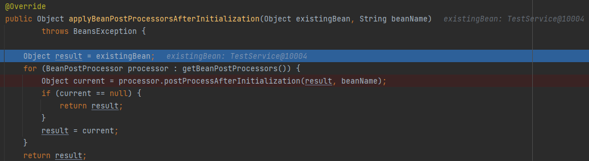
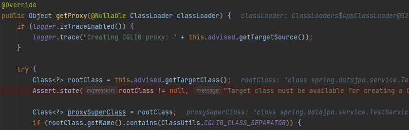

스프링에서 @Transactional이 어떻게 동작하는지 알아본다.

### @Transactional 동작 원리

@Transcational 어노테이션은 AOP 프록시를 통해 동작한다. transactional의 메타 정보와 함께 AOP가 함께 동작하여 AOP 프록시를 만들고 이는 TransactionManager의 구현체와 함께 TransactionInterceptor를 사용한다.

스프링의 TransactionInterceptor는 imperative와 reactive 프로그래밍 모델 둘다 지원 가능한 트랜잭션 관리를 제공한다. 이 인터셉터는 return 타입을 보고 어떤 모델로 지원할지 결정을 한다. Publisher나 Flow타입일 경우 reactive 모델을 지원하며 나머지는 imperative 모델을 지원한다.

imperative 트랜잭션의 경우는 PlatformTransactionManager를 이용해야하고 reactive 트랜잭션은 ReactiveTransactionManager를 이용해야한다.

@Transactional은 주로 PlatformTransactionManager에 관리되는 thread-bound 트랜잭션에 의해 동작한다. 이는 즉 동시에 실행되는 thread들이 데이터 접근 가능함을 의미한다. 물론 이 스레드가 실행되는 와중에 새롭게 시작되는 스레드들에는 전파되지 않는다.

반면에 reactive transaction의 경우는 ReactiveTransactionManager에 의해 관리되고, 이 트랜잭션 관리자는 thread-local 대신에 Reactor context를 사용한다. 결론적으로 모든 reactive pipeline은 같은 reactor context에 의해서 실행되어야한다.

Transaction이 사용되면 aop proxy에 의해서 클래스가 한번 감싸지고 TransactionAdvisor에 의해 transaction이 생성되어서 그 안에서 실제 호출 메소드가 수행되고 이 메소드의 결과값이 다시 프록시로 전달되는 구조이다.

@Transactional 어노테이션이 클래스 레벨에 붙어있을 경우 자신의 부모클래스 레벨에는 전파되지 않는다. 따라서 상속받은 메소드는 다시 재정의해야 클래스레벨의 @Transactional이 동작한다.

만약 transactional 프록시를 사용한다면 이 어노테이션은 public 접근자로 설정되어야 사용이 가능하다. 만약 protected나 private로 선언이 되어있다면 에러는 발생하지 않지만 @Transactional이 기대대로 동작하지 않는다. 만약 non public 메소드를 @Transactional로 동작시키고 싶다면 aspectj기반의 프록시로 동작시켜야 한다.

만약 @EnableTransactionManagement를 @Confiuration안에서 사용한다면 protected나 패키지 기반 메소드들은 transactionAttributeSource 를 빈으로 등록해서 transactional이 동작이 가능하다. 하지만 인터페이스 기반의 프록시는 반드시 public이어야한다.

### @Transactional 동작 순서
@Transactional만 단다고 해서 뭐가 달라지는 것은 아니다. 어노테이션은 단순하게 트랜잭션으로 동작해야된다라고 알려주는 메타데이터이기 때문이다.

그렇다면 이 @Transactional이 선언되었을때 어떤식으로 동작하는지 spring boot 2.5.4 기준으로 확인해본다.

spring boot에서 component scan을 하면서 bean을 생성하고 초기화하는 작업을 한다. 초기화 작업을 AbstractAutowireCapableBeanFactory라는 클래스의 initializeBean이라는 메소드에서 하는데 이 메소드에서 bean이 초기화 후에 추가처리할 작업이 있으면 applyBeanPostProcessorsAfterInitialization라는 메소드를 호출한다.

위의 코드처럼 동작을 하는데, @Transactional이라는 어노테이션이 클래스 자체 혹은 메소드에 달려있을 경우 BeanProcessor라는 상위 클래스의 자식인 AbstractAutoProxyCreator 라는 클래스의 postProcessAfterInitialization를 호출한다. 

이는 다시 wrapIfNecessary메소드를 호출해서 bean객체를 다시 감싸줄 필요가 있으면 감싸주는 작업을 수행한다.

이 메소드는 해당하는 Advice와 Advisor가 있는지 찾기 위해 AbstractAdvisorAutoProxyCreator의 getAdvicesAndAdvisorsForBean 메소드를 호출한다. 이 메소드는 다시 bean 정보를 이용하여 advisor를 찾는 findEligibleAdvisors를 호출한다.

이는 다시 AnnotationAwareAspectJAutoProxyCreator의 findCandidateAdvisors를 호출한다. 이는 AbstractAdvisorAutoProxyCreator의 findCandidateAdvisors를 호출하고 여기서 BeanFactoryAdvisorRetrievalHelper의 findAdvisorBeans메소드를 호출해서 맞는 advisor들을 탐색한다. 여기에는 이미 캐시되어있는 InternalTransactionAdvisor라는 정보가 string형태로 존재해서 이 문자열을 바탕으로 맞는 advisor를 bean으로 가져온다. 이 객체의 클래스가 BeanFactoryTransactionAttributeSourceAdvisor이다.

이 어드바이저는  pointcut이 AnnotationTransactionAttributeSource클래스 인데 이는 @Transactional 어노테이션을 인식하게 하며, 동작하는 위치인 advice는 TransactionInterceptor로 되어있다. 즉 이 어노테이션이 동작하는 위치 앞뒤로 감싸서 인터셉터가 동작하는 원리로 보면 될것이다.

pointcut이 @Transactional로 인식이 되어서 @Transactional이 달려있으면 pointcut으로 인해 advisor가 나오게 되고, 이로 인해 wrapIfNecessary메소드에서 AbstractAutoProxyCreator의 createProxy메소드를 호출하게 된다.

이 createProxy는 ProxyFactory의 getProxy를 호출하게 되고 이는 CglibAopProxy의 getProxy를 호출하여 
@Transactional 대상의 bean을 프록시로 한번 감싸서 동작하게하는게 @Transactional의 원리이다.

참고
- https://docs.spring.io/spring-framework/docs/5.2.x/spring-framework-reference/data-access.html#tx-decl-explained