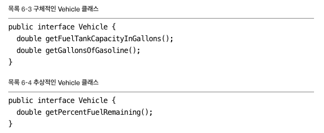
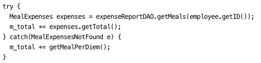
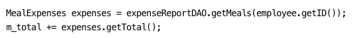
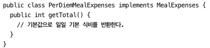

클린코드 책을 읽고 내용을 요약한다.

### 객체와 자료구조

위의 그림에서 6-3 처럼 구체적인 자료를 반환하는 메소드를 인터페이스에 정의하기 보다는, 어떤 자료를 계산해서 특정 자료를 반환하는 메소드를 정의하는 추상화방법이 좀 더 적합하다고 한다. 즉 내부에서 어떻게 구현하든 사용자는 모른 채, 계산하는 함수만 사용자에게 오픈되는 추상화 방식이 좋다고 한다.

#### 디미터의 법칙
위에서 언급한 내용이 이 디미터의 법칙과 동일한 내용을 가르키고 있다. 이 법칙에서 모듈은 자신이 조작하는 객체의 속사정을 몰라야한다는 것을 정의하고 있다. 즉 객체 내부의 자료는 숨기고 동작하는 함수를 공개하는 것이다.

#### 자료 전달 객체
자료 구조체의 전형적인 형태는 공개 변수만 있고 함수가 없는 클래스이다. 이는 다른 말로 Data Transfer Object, 즉 DTO라 한다.

이 파트에서 객체와 자료구조에 대한 차이를 정의하고 있는데 객체는 추상화 뒤로 자료를 숨긴체 자료를 다루는 함수만을 공개하는 개념으로 정의하고 있다. 자료 구조는 자료를 그대로 공개하며 별다른 함수를 제공하지 않는 개념으로 인식하고있다.

### 오류 처리
기본적으로 사용자가 정의한 오류코드를 제공하는 것보다는, 오류를 발견하면 예외를 던지는 편이 더 구현에 있어서 깔끔해진다.

또한 checked Exception보단 unchecked Exception을 던지는 것이 좋다. 기본적으로 C#, C++, 루비, 파이썬에서는 checked 예외가 존재하지 않으며 코드 패턴또한 checked Exception이 좋지않다. 개방폐쇄 원칙을 위반하기 때문인데, 하위 메소드에서 checked 예외를 발생하는 코드를 작성할 경우, try catch로 해당 블록에서 잡아내지 않으면 호출자 전부 throws 문을 작성할 필요가 있다. 즉 기능하나 추가할때 모든 코드가 영향을 미칠 수 있다는 소리이다. 따라서 unchecked 예외가 상황에 따라 다르긴 하지만 대체적으로 좋다.

또한 무조건적으로 예외를 던지는 습관보다는 정상적으로 처리할 수 있으면 정상 흐름으로 처리하는 코드를 작성하는 것도 좋다.

예를 들어 위와 같이 try catch 로 특정 객체가 조회되지 않으면 다른 값을 더하는 동작을 구현할 수 있는데 이는

이와 같이 무조건 더하는 로직을 추가하고

더하는 값을 추상화하고 내부에서 특수 사례 패턴(SPECIAL CASE PATTERN)을 적용해서 특별한 경우 따로 계산하고, 아니면 기본값을 적용하는 코드 방식을 작성해서 구현할 수 있다.

그리고 코드를 작성할 때 어지간하면 null반환하는 코드를 작성하지 않도록 한다. Collection타입의 경우 Collections.emptyList를 호출해서 빈 컬렉션을 반환할 수 있다. null을 반환해야할 경우 예외반환하는 것도 생각을 해볼 필요가있다. 또한 null을 넘기지 않는 방식으로 코드를 작성하는 것이 좋다. null을 넘겨야 될 경우 assert나 예외를 던지는 방향으로 검증하고 애초에 null을 넘기지 않는게 가장 좋다.

### 경계
밑바닥 부터 코드를 짜는 부분은 비용이 많이 든다. 이를 해결하기 위해 외부의 구현체를 가져다가 쓰는 경우가 많다. 이럴 경우 외부 코드 자체의 테스트는 본인이 해야할 일은 아니나, 외부 코드를 이용한 작성 코드는 본인의 책임이며, 외부코드가 동작하는 것을 읽는 것은 쉽지 않다. 이를 학습하기 쉽게 하는 방법중의 하나가 테스트 케이스를 작성해서 외부코드를 익히는 방식인 학습테스트가 있다.

또한 다른 팀과 협업을 해야할 경우, 아직 다른 팀이 구현하지 않은 api를 이용해야할 경우가 있다. 이럴때 할 수 있는 방법이 인터페이스를 정의하는 것이다. 이용하고자하는 api의 인터페이스를 정의한 후, 이를 구현하는 더미 구현체를 작성한다.

참고
- 클린코드